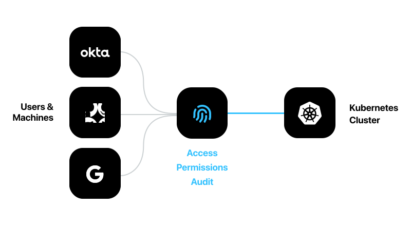

<br/>
<br/>
<br/>
<p align="center">
  
</p>
<br/>
<br/>

## Introduction
Infra makes managing user access to Kubernetes easy & secure.

No more out-of-sync Kubeconfigs, lengthy scripts to map permissions, or untraceable service accounts. 

Infra enables teams to **dynamically** grant access to _right users or machines_ with the _right permissions_ for _the right amount of time_. Under the hood, Infra takes care of provisioning identities, creating & revoking credentials and generating fine-grained permissions on-the-fly.

<br/>
<p align="center">
  
</p>
<br/>

### Features
* One-command access: `infra login`
* Fine-grained permissions
* Onboard & offboard users via Okta (Azure AD, Google, GitHub coming soon)
* Audit logs for who did what, when (coming soon)
* CLI & REST API
* Configure via `infra.yaml`

### Quickstart

####  1. Deploy Infra Engine on Kubernetes

```
$ kubectl apply -f https://raw.githubusercontent.com/infrahq/infra/master/deploy/kubernetes.yaml
```

Infra exposes a LoadBalancer endpoint:

```
$ kubectl get svc --namespace infra
NAME      TYPE           CLUSTER-IP     EXTERNAL-IP     PORT(S)        AGE
infra     LoadBalancer   10.12.11.116   31.58.101.169   80:32326/TCP   1m
```

Optionally, map a domain to the exposed endpoint (e.g. `infra.acme.com` to `31.58.101.169`).

#### 2. Configure Infra Engine

Infra is configured via an `infra.yaml` file:

```yaml
$ cat <<EOF | kubectl apply -f -
apiVersion: v1
kind: ConfigMap
metadata:
  name: infra
  namespace: infra
data:
  infra.yaml: |-
    users:
      - email: admin@acme.com
        permission: admin
      - email: jeff@acme.com
        permission: edit
        namespace: default
EOF
```

#### 3. Log in via Infra CLI

Generate an login token via `kubectl`:

```
$ kubectl -n infra exec infra-0 -- infra token create --user admin@acme.com
sk_r6Khd35Dt3Q4KgyuPFw2NkRkGpgorI8uyDgpW215quR7
```

Install Infra CLI on your client machine:

```bash
# macOS
$ curl --url "https://github.com/infrahq/infra/releases/download/latest/infra-darwin-$(uname -m)" --output /usr/local/bin/infra && chmod +x /usr/local/bin/infra

# Linux
$ curl --url "https://github.com/infrahq/infra/releases/download/latest/infra-linux-$(uname -m)" --output /usr/local/bin/infra && chmod +x /usr/local/bin/infra

# Windows 10
$ curl.exe --url "https://github.com/infrahq/infra/releases/download/latest/infra-windows-amd64.exe" --output infra.exe
```

Finally, log in as `admin@acme.com`:

```
$ infra login --token sk_r6Khd35Dt3Q4KgyuPFw2NkRkGpgorI8uyDgpW215quR7 infra.acme.com
✔ Logging in with Okta... success
✔ Logged in as admin@acme.com
✔ Kubeconfig updated
```

That's it. You now have cluster access as `admin@acme.com`:

```
$ kubectl get pods -A
kube-system   coredns-56b458df85-7z4ds          1/1     Running   0          2d4h
kube-system   coredns-56b458df85-wx48l          1/1     Running   0          2d4h
kube-system   kube-proxy-cxn9c                  1/1     Running   0          2d4h
kube-system   kube-proxy-nmnpb                  1/1     Running   0          2d4h
kube-system   metrics-server-5fbdc54f8c-nf85v   1/1     Running   0          46h
```

## Documentation
* [Managing users](./docs/users.md)
* [Integrate Okta](./docs/okta.md)
* [Configuration File](./docs/configuration.md)
* [CLI Reference](./docs/cli.md)
* [API Reference](./docs/api.md)

## Develop

Clone the project:

```bash
git clone https://github.com/infrahq/infra
cd infra
```

Run locally:

```bash
go run .
```

## Test

Run tests:

```bash
go test ./...
```

## Release

Setup

* [GitHub CLI](https://github.com/cli/cli)
* [gon](https://github.com/mitchellh/gon) for signing MacOS binaries: `go get https://github.com/mitchellh/gon`

```
make release         # Build, sign and upload binaries
make release/docker  # Build and push Docker images
```

## Security
We take security very seriously. If you have found a security vulnerability please disclose it privately to us by email via [security@infrahq.com](mailto:security@infrahq.com)
