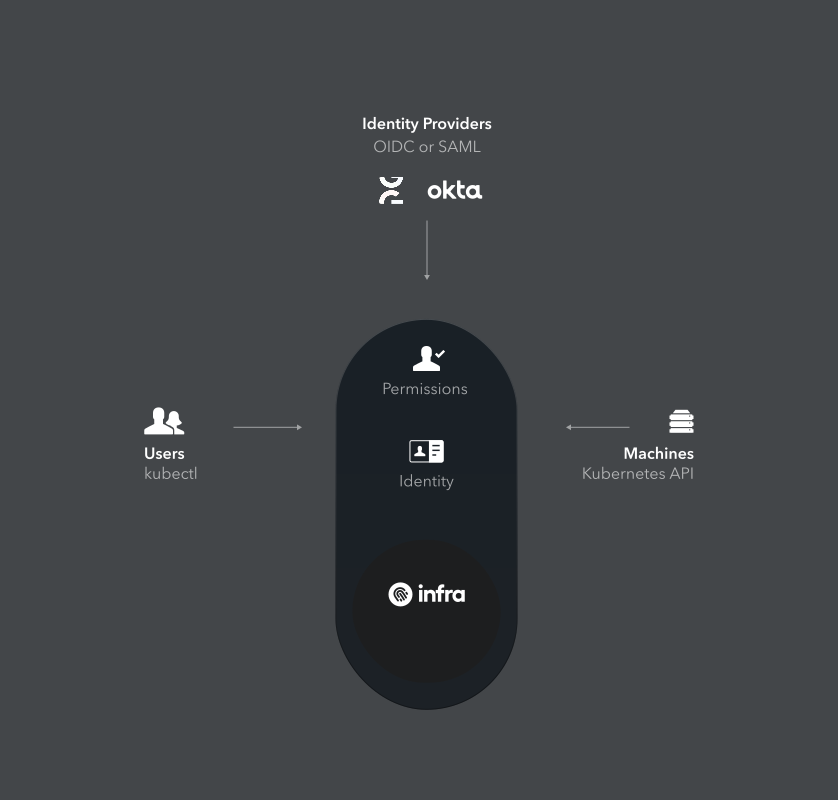

<p align="center">
  
</p>

## Introduction
Infra is identity and access management for Kubernetes. Instead of creating separate credentials and writing scripts to map permissions to Kubernetes, developers & IT teams can integrate existing identity providers (Okta, Google accounts, GitHub auth, Azure active directory) to securely provide developers with access to Kubernetes.

### Features
* One-command access: `infra login`
* Fine-grained permissions
* Onboard & offboard users via Okta (Azure AD, Google, GitHub coming soon)
* Audit logs for who did what, when (coming soon)
* CLI & REST API
* Configure via `infra.yaml`

## Architecture

<p align="center">
  
</p>

## Install

### Install Infra Engine on Kubernetes

```
kubectl apply -f https://raw.githubusercontent.com/infrahq/early-access/master/deploy/kubernetes.yaml
```

Infra exposes a LoadBalancer endpoint:

```
kubectl get svc --namespace infra
```

Optionally, map a domain to the exposed endpoint (e.g. `infra.acme.com` to `31.58.101.169`):

```
$ kubectl get svc --namespace infra
NAME      TYPE           CLUSTER-IP     EXTERNAL-IP     PORT(S)        AGE
infra     LoadBalancer   10.12.11.116   31.58.101.169   80:32326/TCP   1m
```

### Install Infra CLI

On **macOS**:

```
curl -L "https://github.com/infrahq/infra/releases/latest/download/infra-darwin-$(uname -m)" -o /usr/local/bin/infra && chmod +x /usr/local/bin/infra
```

On **Linux**:

```
curl -L "https://github.com/infrahq/infra/releases/latest/download/infra-linux-$(uname -m)" -o /usr/local/bin/infra && chmod +x /usr/local/bin/infra
```

On **Windows**:

```
curl.exe -L "https://github.com/infrahq/infra/releases/download/latest/infra-windows-amd64.exe" -o infra.exe
```

## Adding Users
* [Okta](./docs/okta.md)
* [Manually manage users](./docs/manual.md)


## Documentation
* [Configuration Reference](./docs/configuration.md)
* [CLI Reference](./docs/cli.md)
* [API Reference](./docs/api.md)


## Develop

Clone the project:

```bash
git clone https://github.com/infrahq/infra
cd infra
```

Run locally:

```bash
go run .
```

## Test

Run tests:

```bash
go test ./...
```

## Release

Setup

* [GitHub CLI](https://github.com/cli/cli)
* [gon](https://github.com/mitchellh/gon) for signing MacOS binaries: `go get https://github.com/mitchellh/gon`

```
make release         # Build, sign and upload binaries
make release/docker  # Build and push Docker images
```

## Security
We take security very seriously. If you have found a security vulnerability please disclose it privately to us by email via [security@infrahq.com](mailto:security@infrahq.com)
