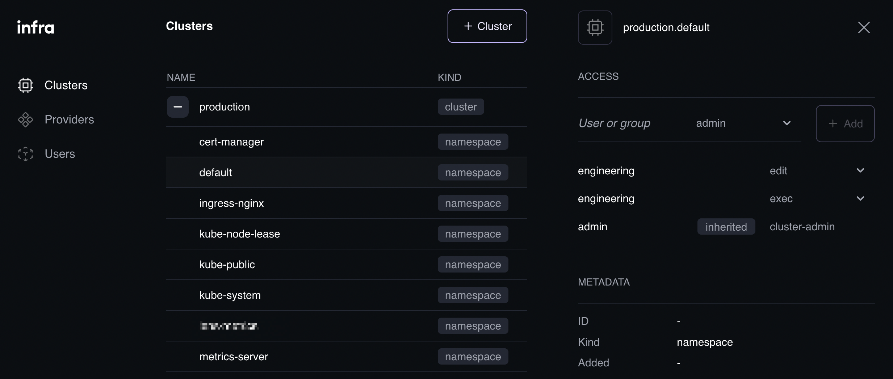
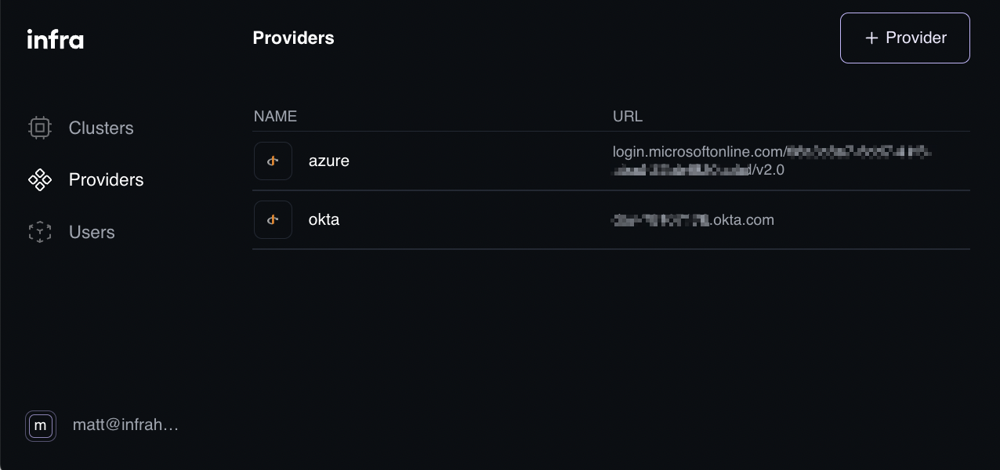
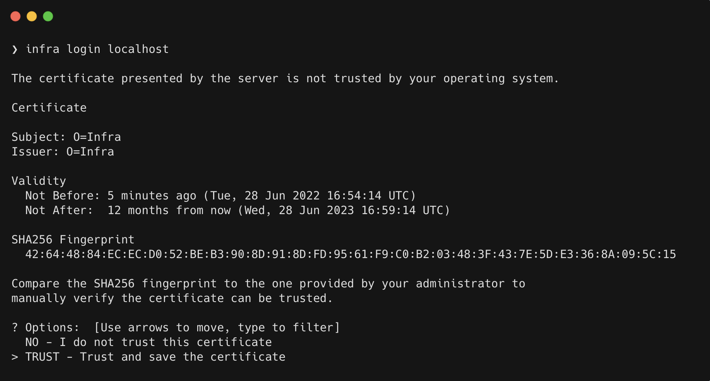

**We have finished another sprint and thus have a new release...well, we actually have two releases as of June 27.** We added groups support for Azure, some new features in the UI like editing your password and namespace access, and some new features in the CLI like JSON output and a prompt to verify the new server certificate. And then the next day we made a release that added my favorite new feature... some improvements around configuring roles in the UI.

One of the biggest new features for a lot of users is group support in Azure. From day one we supported OIDC for authentication. But while OIDC is used by a lot of providers, how they implement users and groups turns out to be different. So although we didn't push the feature we knew it should work with other OIDC providers and some might require some tweaks to their flavor of OIDC. With Azure Active Directory, some of the basic features worked right away, but groups did not.

As of this release, you can setup the OIDC integration with Azure Active Directory and the grants you assign in Infra for users and groups will work as expected. For now this is just when configuring the provider via the CLI, but we will be enabling that in the UI soon. We will also be going through other OIDC providers to verify they all work as expected. If you have a provider you need to use which doesn't seem to be working, let us know so we can look into it.

But you don't have to use an OIDC provider. You could use locally created users. If you do, until recently you couldn't change your own password in the UI. Now you can. Just go down to the user menu at the bottom left of the UI and click Settings. Click the Change button to the right of your password. Your password will be changed.

Also in the UI, you can now see namespaces for your clusters. When you click on Clusters on the left menu, click on the name of the cluster to see all of the namespaces in that cluster. Now you can enter a username and a role and that role will be applied for that namespace on the cluster.

When using the CLI, the output is always formatted for human consumption. But sometimes you want to include **Infra** in a script and that means formatting the output as something easier for a computer to process. We just added a `--format` flag which can be used in most places in the CLI. For instance, `infra users list --format=json` will output the users list as a JSON blob. YAML will be added as a format soon.

When logging in to a new server, your OS probably won't already trust the server's TLS certificate. In the past we would display the notice to use `--skip-tls-verify`. Now it will show you information about the certificate and prompt you to verify the fingerprint. After trusting it, it will maintain that trust until you logout using `infra logout --clear`.

My favorite feature added in this release is this last one. And its actually a collection of additions in the UI. The first addition is typeahead. Now in any entry field in the UI where you had to type the name of a user or group, it will give you a list of choices and filter that list down as you type. When you add a user or group for a grant, you now see a list of all the roles on your server. This includes all the roles added with the **Infra** install, as well as any custom roles with the label `app.infrahq.com/include-role` set to true. I am so excited about both of these.

When you are ready to upgrade, remember there are three pieces. First update the CLI
Instructions for each OS can be found here: [https://infrahq.com/docs/install/install-infra-cli](https://infrahq.com/docs/install/install-infra-cli). Then update the Infra Helm repo: `helm repo update infra`. Then upgrade the server: `helm upgrade infra infrahq/infra` and each of the connectors: `helm upgrade infra-connector infrahq/infra`.
