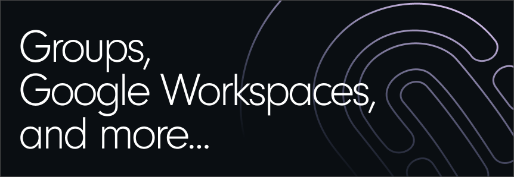
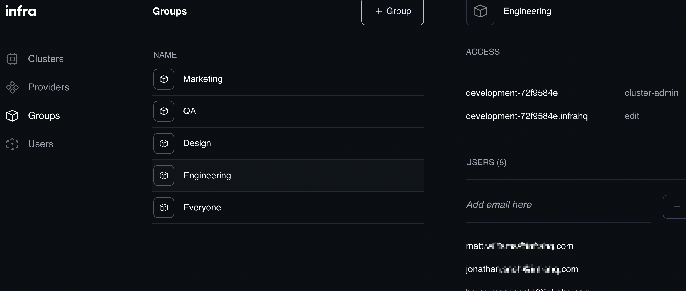
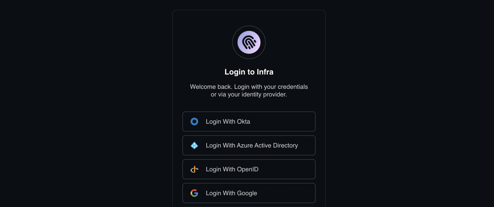

**Today we released version 0.14.0 of Infra**. The headliner features for this release are support for groups in the Dashboard, and integration with Google Workspaces as an Identity Provider. And of course there was also a number of other features and updates.

In this latest release **we now are supporting group management in the Infra Dashboard**. This means supporting both groups from OIDC integrations as well as locally defined groups.

**We also now support working with users and groups from your Google Workspace**. You can find the documentation for setting this up [here](https://infrahq.com/docs/identity-providers/google). With this Infra now supports users and groups from Okta, Azure AD, and Google Workspace.

There were also a number of other features and updates added to Infra in this release. These include preparation for password requirments, better Identity Provider buttons, pagination in the CLI and preparation for pagination in the UI, and improving our support for postgres as a backing database. You can read all the details in the release [here](https://github.com/infrahq/infra/releases/tag/v0.14.0).
