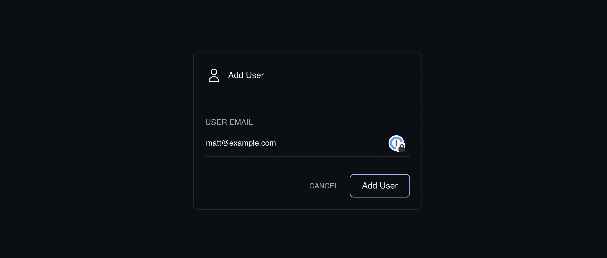

**Users don't exist in Kubernetes.** Depending on your experience and where that experience is focused, that statement may be a bit confusing. You might be a developer building out an application deployed to Kubernetes. You have been given a kubeconfig file that lets you 'login' to the platform. But that file doesn't actually connect to a 'user'. Instead, it's a set of permissions in the form of a role that have been applied to a context. And that context is defined by a set of certificates. All of that combined is what we might refer to as a user, but that term is not actually known anywhere in the platform.

So how do we create this set of certificates to create a user? Well, it's not really that hard, but it is a long string of steps you need to follow and we will go through them now.

Note: This blog is based on a video we released about creating users in Kubernetes. You can find the video here:



## Create the User Key

The first step is to create the source key that represents our user. This key is created using a tool like [openssl](https://www.openssl.org/) but another popular tool to use is [cfssl](https://github.com/cloudflare/cfssl), created by Cloudflare. [Some folks think cfssl is easier to use](https://twitter.com/kelseyhightower/status/615241033010393088?lang=en), and it definitely looks easier to script. But for this example we will use openssl. You can also choose to create the key using a number of different algorithms. For this example we will use [ED25519](https://cryptobook.nakov.com/digital-signatures/eddsa-and-ed25519).

Assuming we want to output a key to `myuserkey.key`:

```bash
openssl genpkey -out myuserkey.key -algorithm ed25519
```

In case you wanted to use RSA 4096 instead of ED25519:

```bash
openssl genrsa -out myuserkey.key -length 2048
```

That key on it's own doesn't have any value with respect to Kubernetes. We need to sign it first.

## Create the Certificate Signing Request

In order to sign it we need to create a certificate signing request and then submit that request to Kubernetes. To create that request we run:

```bash
openssl req -new -key myuserkey.key -out myuserkey.csr -subj "/CN=myuser/O=edit"
```

Let's take a closer look at that command. First there is `req`. The `req` command creates and processes certificate requests. `-key` lets us specify the key created with the genpkey command. `-out` specifies the output csr. Finally there is `-subj`. There is a lot that we can put in here, but Kubernetes just needs a Common Name and an Organization, which is used to define groups. If you don't include a `-subj` option, you will be prompted for a number of other options, like OU.

## Submit the CSR to Kubernetes

OK, so now the CSR has been created. Now we need to submit that to Kubernetes. As with everything in Kubernetes we need to generate a YAML file.

```bash
cat <<EOF | kubectl apply -f -
apiVersion: certificates.k8s.io/v1
kind: CertificateSigningRequest
metadata:
  name: myuser
spec:
  request: LS0tLS1CRUdJTiBDRVJUSUZJQ0FURSBSRVFVRVNULS0tLS0KTUlHaE1GVUNBUUF3SWpFUk1BOEdBMVVFQXd3SWRHVnpkSFZ6WlhJeERUQUxCZ05WQkFvTUJHVmthWFF3S2pBRgpCZ01yWlhBRElRRG9hVURHVHdYRXYyRjVBTk9yQW9QV0ZvWGhSbTlGQjFQSkpuVUFaWlJGZ0tBQU1BVUdBeXRsCmNBTkJBUGZUMldaVGU3R1VJcGVHZnhTbC93WFFTZGZPQmRoeFg5Q05CMEZpOEdteDhIaDcvd2hkVEgwUXRxWmEKWGthZ0h6ejVUbXRKWnNKZDQ4QlpCb3BLdFEwPQotLS0tLUVORCBDRVJUSUZJQ0FURSBSRVFVRVNULS0tLS0K
  signerName: kubernetes.io/kube-apiserver-client
  expirationSeconds: 86400  # one day
  usages:
  - client auth
EOF
```

And now for the explanation of this command. The `cat <<EOF ... EOF` is a nice [simple way of running a multiline command](https://linuxhint.com/what-is-cat-eof-bash-script/). Hopefully apiVersion and kind make sense. We specify the name of the CSR in the metadata. The name can be anything, but its nice to keep the name consistent. The biggest part of this command is under `spec.request`. The content of this is simply the output of the csr file after it has been base64 encoded.

If you just run `cat myuser.csr | base64` you will get the csr with a bunch of newlines added. So the command you want is:

```bash
cat myuser.csr | base64 | tr -d "\n"
```

And then paste the output of that to `spec.request` above. `spec.expirationSeconds` is the next decision you need to make. This defines how long the signed certificate will be valid before it expires. You want it to be a relatively short amount of time but not too short. What is too short? Well you will need to distribute a unique cert in the form of a kubeconfig file to each of your users. If you have a mechanism to distribute the file so that it can be automatically updated, then keeping this value as small as minutes is ideal. But you will often see values of months or years.

## Getting the Approved Certificate From the Cluster

Now that the CSR is submitted to the cluster, we need to approve the request.

```bash
kubectl certificate approve myuser
```

That command was easy. But in order to use the new certificate, we need to download it and put it into a kubeconfig file. The resource in Kubernetes for Certificate Signing Requests is `csr`. So you can probably figure out the command to use for this:

```bash
kubectl get csr/myuser -o yaml
```

Of course, that gets us the csr as well as all the metadata about the request. We want just the cert, but its stored base64 encoded. So to get it out we can run this command:

```bash
kubectl get csr myuser -o jsonpath='{.status.certificate}'| base64 -d > myuser.crt
```

That was a lot of steps to get to a cert file. If you look around for this process, you will find a lot of tutorials that tell you to just download the certificate and key for the Certificate Authority in the cluster. The problem with taking that approach is that using managed Kubernetes is a very common scenario. And in most cases with managed Kubernetes you don't have access to the controlplane and thus you cannot scp those two files to your machine. But using the cluster to approve the certificate will work whether you are using managed or unmanaged Kubernetes.

## Build the Kubeconfig File

There are three commands you can use to build the kubeconfig file. One to use to set the user, another to set the context, and a third to set the cluster. Unfortunately to set the cluster, you need the CA cert, but remember we don't have access to that since we are probably using a managed cluster. But we have just run a bunch of commands against the cluster to generate the signed certificate. So we have a kubeconfig file for the cluster admin and we can leverage that.

Make a copy of your kubeconfig file and delete everything except the one cluster we created a user for. You will end up with something like this:

```yaml
apiVersion: v1
clusters:
  - cluster:
      certificate-authority-data: LS0tLS1CRUdJTiBDRVJUSUZJQ0FURS0tLS0tCk1JSURKekNDQWcrZ0F3SUJBZ0lDQm5Vd0RRWUpLb1pJaHZjTkFRRUxCUUF3TXpFVk1CTUdBMVVFQ2hNYourKeyWillBeALotLongerThanThisx2SW4rQTk3cGZWUDBGTGdUOVlteitpdzAwOHFXY1ZKdz09Ci0tLS0tRU5EIENFUlRJRklDQVRFLS0tLS0K
      server: https://af03b3bogus39-483c-b55f-4cserverurle60c.k8s.ondigitalocean.com
    name: k8s
```

This part is going to be the same regardless of the role you have.

Now lets add the user.

```bash
kubectl --kubeconfig myuserconfig config set-credentials myuser --client-key=testuserkey.key --client-certificate=testuserkey.crt --embed-certs=true
```

The `--kubeconfig myuserconfig` specifies which kubeconfig file you want to set the credentials in. `config` says we are building a kubeconfig file. `set-credentials myuser` means that we are setting the credentials in the file mention for an entity known as `myuser`. `client-key` and `client-certificate` set the corresponding files. Now if that's all you type, you will get a file that simply refers to each of the files. So if you want to share the kubeconfig file with another person, you will need to also share the certificate and key file. Adding the option `embed-certs=true` will embed them inline making the file easier to share.

Finally run this command to add a context.

```bash
kubectl --kubeconfig myuserconfig config set-context myuser --cluster=k8s --user=myuser
```

`set-context` sets the name of the context. And `cluster` and `user` set each of those items. So what is a context? Well it is simply a binding between the user and the cluster. When you use a tool like the krew plugin `kubectl ctx`, it's the context that you are choosing.

Now you are done setting up a new user for your cluster. It's not that difficult to do, though there are a lot of commands you need to run. And quite a lot of it is boilerplate, with a few key items updated for each user. You could definitely script it, and you could also use the great script Brendan Burns created and shared on his GitHub. But even with tools like that, you still need to come up with a way to distribute the generated kubeconfig file. And this could be the most challenging part of the process.

## Doing Everything in Infra Instead



An alternative to this is to use Infra to build out your users and groups, as well as distribute the files. Just sign in, navigate to Users and fill in the field to enter the user's email address. Then navigate to Clusters and choose your cluster. Now select the user you just created from the dropdown and specify a role. And you are done. Actually that's two more steps than what we did without Infra, which would require coming up with another YAML file to define a role and then another to bind the role to the user, then apply the two files.

And that is everything you need to do to create a user in Kubernetes. It is strange that while the 'user' isn't a first class resource in Kubernetes itself, it is recognized in the kubeconfig file. And it's strange that creating a user isn't a single step command in `kubectl`. But thankfully tools like **Infra** make what is a complicated multistep process into a something that can be completed in seconds. If you aren't already using Infra, try it out. With our [Quickstart](https://infrahq.com/docs/getting-started/quickstart) you can be up and running in a few short minutes no matter where your Kubernetes cluster lives.
