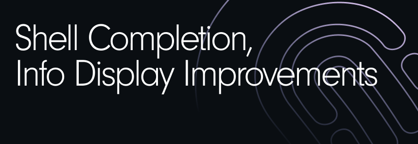

### Shell Completion

Infra's CLI now includes **shell completion**. If you have ever used Infra and had to run the `infra help` command to remind of the options, this feature is for you. Now press the tab key to see a list of all the commands and subcommands. Run `infra completion` to generate the completion script and it supports bash, zsh, fish, and powershell.

### CLI truncating

If you have a lot of users in a group and then you list them out, the list can be long and it can be difficult to read. Infra's CLI will now truncate that list to make that easier. To see all results, the CLI now has a `--no-truncate` option.

### Group member counts

When viewing groups in the Dashboard and CLI, or using the API, you now see the number of users within each group.

The full changelog can be found [here](https://github.com/infrahq/infra/releases/tag/v0.14.0).
