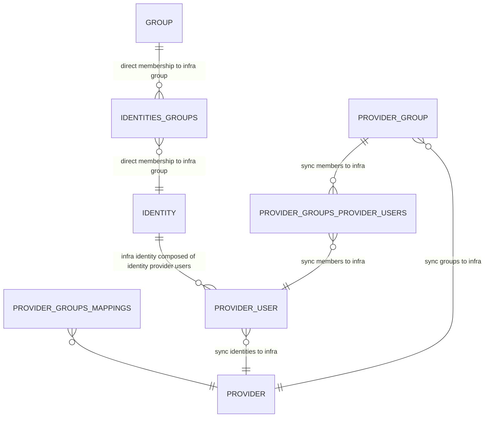

# Identity Provider Tracking
Infra tracks users and groups that exist in external identity providers and maps them access. The following database diagram shows how the relation of groups and users in identity providers are mapped to users and groups within Infra.

Our identity system has two different type of relations, one of which exists in Infra (users and groups controlled by Infra), and the other relation which exists externally (information about users and groups which exist in an identity provider).

To get all the groups a user belongs to as a combination of direct group membership and membership in a mapped identity provider group use the `resolved_identity_groups` view.

## Users and Groups Managed by Infra
The following tables represent users whose identity is managed by Infra and groups which are controlled by Infra.
- **Identities**: Known information about a user. This may be a an email and password hash that can be used to login to Infra directly, or information about a user that has logged via an identity provider.
- **Groups**: Groups which exist in Infra that membership to grants access to some resource.
- **Identities_Groups**: Identities that have been added as a member of a group within Infra, this membership is added through either membership in an external identity provider group or through direct assignment (represented in the database as being part of an Infra provider group).

## Users and Groups Managed by an Identity Provider
- **Provider_User**: A user that exists in an identity provider.
- **Provider_Group**: A group that exists in an identity provider.
- **Provider_Groups_Provider_Users**: This relation shows which users of an identity provders are members of which groups in the same identity provider.

