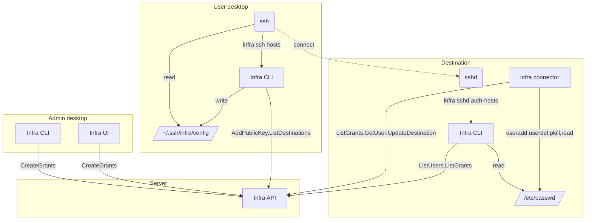

# SSH Destinations

The diagram below shows how SSH destinations are connected to Infra.

First an organization admin installs the connector on the host, and grants access
to the destination. The connector runs as a `systemd` service that long polls for
changes to grants. When a grant is added a user is created on the host,
and when a grant is removed, the processes for that user are killed, and the user
is removed.

When a user does `infra login` for the first time, their `~/.ssh/config` is updated
to use the `infra` CLI to match hostnames to the list of destinations the user has
access to.

A user connects to the destination using `ssh <hostname>`. `ssh` calls
`infra ssh hosts` to ensure a public key exists for the user, and to create a
config and known_hosts file in in `~/.shh/infra/`.

`ssh` connects to `sshd` using the config generated by `infra`. On the server side
`sshd` calls `infra sshd auth-keys` to get the users public key from the Infra API
and to ensure the username in the request is for a user managed by infra, and that
the user is granted access to the host. Once those checks pass, the user is
connected via `ssh`.
