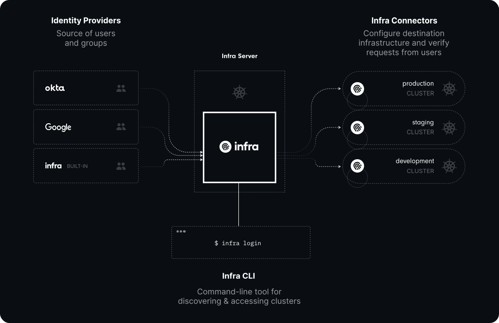

# Key Concepts

## Architecture

 

 

### 1. Infra Server

The Infra Server is the main component of Infra. It provides an API for managing identities, groups, and their access in a single location.

### 2. Infra CLI

The Infra CLI is the primary way to access infrastructure. It's also used for managing identities, groups and more.

### 3. Infra Login

Once you install Infra and the Infra CLI, you can login to Infra and start connecting identities, infrastructure, and granting access to your team.

### 4. Identities

You can add your team by either using your identity provider such as Okta, Active Directory, or you can use built-in users from Infra.

### 5. Connectors

Connectors are responsible for authenticating and provisioning user access in destinations such as a Kubernetes cluster or database.

### Putting it all together

Infra works by connecting identities to specific destinations via _connectors_. Users log in via the Infra CLI, configure access, and finally install connectors. Once set up, anyone on the team can run `infra login` to get access to the infrastructure they need:

 

## Core API Resources

### Identities

`infra identities` – `/v1/identities`

Identities are individual users that can log in via infra to access infrastructure.

### Groups

`/v1/groups`

Groups are sets of identities (usually representing a team or organization) that can share access.

### Destinations

`infra destinations` – `/v1/destinations`

Destinations are infrastructure resources that can be accessed via Infra. Examples of destinations include:

* Kubernetes clusters (e.g. `production-cluster`)
* Kubernetes namespaces (e.g. `production-cluster.web`)

### Grants

`infra grants` – `/v1/grants`

Grants are based on the simple relationships between identities/groups (i.e. _subjects_), roles/permissions (i.e. _privileges_), and Kubernetes clusters or namespaces (referred to as _resources_)

Grants are implemented in an additive model where the base configuration is to not provide any access. As grants are applied to Infra, subjects will progressively gain access to Infra and connected destinations.

Grants tie identities (or groups) to destinations with a specific role. In other words, a grant decides **who can access what, with what level of access (often called role)**.

### Providers

`infra providers` – `/v1/providers`

Providers are short for **identity providers**. They are external sources of identities and groups such as Okta, Google and Azure.
