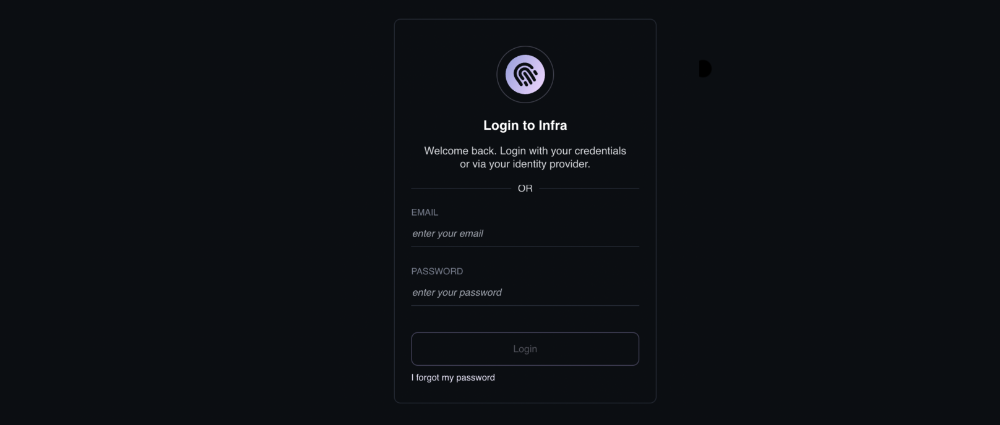

# Quickstart

## Prerequisites

- Install [helm](https://helm.sh/docs/intro/install/) (v3+)
- Kubernetes (v1.14+)

## Deploy Infra

Create a `values.yaml` file to define the first user. Update the email address and password accordingly:

```yaml
server:
  config:
    users:
      - name: admin@example.com
        password: SetThisPassword!

    grants:
      - user: admin@example.com
        role: admin
        resource: infra
```



In this example we are setting a password in plaintext. Refer to the [Helm Reference](../reference/helm-reference.md) doc to learn more about using secrets in the Helm values file.



Deploy Infra via `helm`:

```
helm repo add infrahq https://helm.infrahq.com
helm repo update
helm install infra infrahq/infra --values values.yaml
```

## Access the Infra Dashboard

Next, visit the Infra Dashboard. To retrieve the hostname, run:

```
kubectl get service infra-server -o jsonpath="{.status.loadBalancer.ingress[*]['ip', 'hostname']}" -w
```

Visit this hostname in your browser to access the Infra Dashboard:





Note: it may take a few minutes for the LoadBalancer to be provisioned.

If your load balancer does not have a hostname (often true for GKE and AKS clusters), Infra will not be able to automatically create a TLS certificate for the server. On GKE you can use the hostname `<LoadBalancer IP>.bc.googleusercontent.com` instead of `localhost`.

Otherwise you'll need to configure the LoadBalancer with a static IP and hostname (see
[GKE docs](https://cloud.google.com/kubernetes-engine/docs/tutorials/configuring-domain-name-static-ip), or
[AKS docs](https://docs.microsoft.com/en-us/azure/aks/static-ip#create-a-static-ip-address)).
Alternatively you can use the `--skip-tls-verify` with `infra login`, or setup your own TLS certificates for Infra.



After logging in to the UI, navigate to **Clusters**. Click the **+ Cluster** button at the top right. Enter a name for the cluster and click **Next**. Copy the command shown in the UI and paste it into your terminal and press Enter to run the command. This will add the Kubernetes Connector.

## Next Steps

- [Customize](../reference/helm-reference.md) your install with `helm`
- [Connect Okta](../identity-providers/okta.md) (or another identity provider) to onboard & offboard your team automatically
