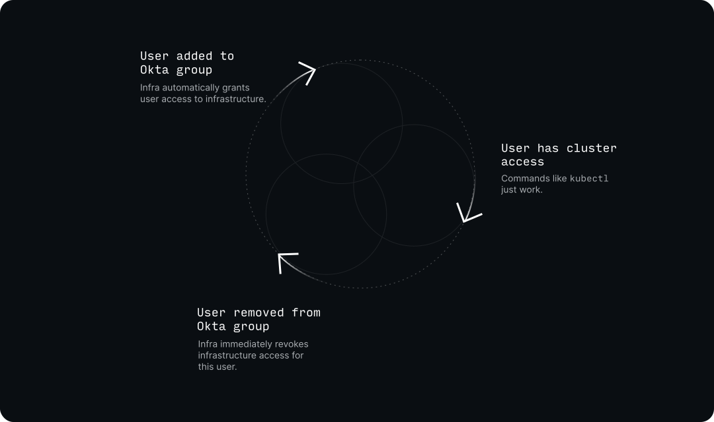
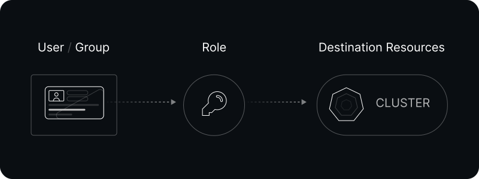

# What is Infra?

## Introduction

Infra is a service for managing secure access to infrastructure such as Kubernetes. It integrates with existing identity providers such as Okta to automatically grant & revoke access to the right users and groups at the right time.

### Features

- **Discover & access** infrastructure via a single command: `infra login`
- **No more out-of-sync credentials** for users (e.g. Kubeconfig)
- **Okta, Google, Azure AD** identity provider support for onboarding and offboarding
- **Fine-grained** access to specific resources that works with existing RBAC rules
- **API-first design** for managing access as code or via existing tooling
- [**Open-source**](https://github.com/infrahq/infra) and can be deployed anywhere

### Coming Soon

- **Dynamic access** to coordinate access with systems like PagerDuty
- **Access requests** to eliminate static access
- **Audit logs** for who did what, when

### Walkthrough



## Use Cases

### Automatic onboarding & offboarding

Infra includes deep integration with identity providers such as [Okta](../identity-providers/okta.md). Users are automatically onboarded and provided access to the resources they need without having to create additional accounts:



Unlike other tooling, Infra continously verifies users' information with upstream identity providers so access is revoked immediately.

### Configure access as code

Infra supports configuring **access as code** via Git-managed configuration.

Identity providers, users, groups and more can be entirely defined in code, meaning all access is traced back into GitHub, GitLab or other source control systems:

```yaml
grants:
  # grant the Engineering group `admin` access to the `development` cluster
  - group: Engineering
    role: admin
    resource: development

  # grant the Oncall group `edit` access to the `production` cluster
  - group: Oncall
    role: edit
    resource: production

  # grant the WebDev group `edit` access to the `web` namespace in the `production` cluster
  - group: WebDev
    role: edit
    resource: production.web

  # grant the Compliance group `view` access to the `development` cluster
  - group: Compliance
    role: view
    resource: development

  # grant the carl@example.com user `edit` access to the `development` cluster
  - user: carl@example.com
    role: edit
    resource: development

providers:
  # Allow above users and groups to access via an Okta account
  - name: okta
    url: acmecorp.okta.com
    clientID: 0oapn0qwiQPiMIyR35d6
    clientSecret: vU-baksdh19087j_s0sn7sjzxasj9aAS12SANjyKzl
```

### Fine-grained access

Most RBAC or access tooling is _coarse_ grained, meaning users usually receive **admin or nothing** access to infrastructure. With Infra, users or groups can be provided access to specific resources:

```
# grant `view` access for the Engineering group to the
# cluster and `edit` access to the `web` namespace
$ infra grants add -g Engineering production --role view
$ infra grants add -g Engineering production.web --role edit
```

### Dynamic or just-in-time access

Using Infra's API, access can be granted and revoked on-the-fly for users who need it for a limited amount of time. For example, if `suzie@infrahq.com` is starting their on-call schedule, they can be granted and revoked access automatically via an `infra` CLI command or API call:

```
# grant escalated production cluster access to suzie@infrahq.com
$ infra grants add suzie@infrahq.com production --role admin

# ...wait an hour, day or week...
$ sleep 3600

# revoke escalated production cluster access
$ infra grants remove suzie@infrahq.com production --role admin
```

### Multi-cloud access

Infra works on any major cloud provider and doesn't depend on any existing identity & access management system such as AWS, Google Cloud or Azure IAM:

```
$ infra list
  NAME (4)                          ACCESS
  development-aws-us                admin
  development-aws-eu                edit
  production-azure                  view
  production-gcp                    view
```

## Example Usage

### Logging In

```
$ infra login
? Select a server:
  production.infrahq.com
> testing.infrahq.com
  development.infrahq.com
? Select an identity provider:
> okta (infra.okta.com)
  Login with username and password
  Login with an access key
  ...
  Logging in with okta...
  Logged in as suzie@infrahq.com
```

### Viewing access

```
$ infra list
  NAME                         ACCESS
  production                   view
  production-delta             edit
  production-eu-1              admin
```

### Connecting to a cluster

After running `infra login`, users' Kubeconfig and `kubectl` **just work**:

```
$ infra use production
Switched context to `production`

$ kubectl get pods
argocd          argocd-application-controller-7d7bdb9545-qg5q8            1/1     Running   0          63d
argocd          argocd-redis-5968fdb6cc-xzwtp                             1/1     Running   0          117d
argocd          argocd-repo-server-658f67f8c8-csffr                       1/1     Running   0          63d
argocd          argocd-server-5c77b68cb-xhbhs                             1/1     Running   0          117d
cert-manager    cert-manager-7645bbbcc9-gxm27                             1/1     Running   0          117d
cert-manager    cert-manager-cainjector-5bcf77b697-fj6s6                  1/1     Running   0          117d
...
```

### Inspecting access

Admins can inspect access in a single place, for all users & groups across all destinations:

```
$ infra grants list
  USER (6)            ROLE       DESTINATION
  jeff@infrahq.com    view       development-72f9584e
  mike@infrahq.com    edit       development-72f9584e.infrahq
  eva@infrahq.com     admin      digital_ocean_toronto

  GROUP (5)    ROLE    DESTINATION
  Everyone     view    development-72f9584e
  Engineering  edit    development-72f9584e.infrahq
  Design       edit    development-72f9584e.web
  Everyone     admin   digital_ocean_toronto
```

## Concepts

### Destinations

Destinations are infrastructure services (e.g. a Kubernetes cluster) that can be accessed via Infra. Destinations may contain **resources** (e.g. Kubernetes namespaces) for more fine-grained access.

### Connectors

Connectors are what establish a secure connection to infrastructure [destinations](#destinations) and allow Infra to manage [user](#users) & [group](#groups) access to them. Read more on [how connectors work](../reference/architecture.md#infra-connectors).

### Users

Users are individual identities that exist within Infra. Infra has built-in users, and users can be created by integrating [identity providers](#identity-providers).

### Groups

Groups are a collection of users. Like users, groups are often imported via [identity providers](#identity-providers). This is especially powerful: a user can be granted and revoked access by simply adding & removing them to a group in an upstream identity provider.

### Grants

Grants represents units of access in Infra. They combine three concepts:

1. User or group (e.g. `jeff@infrahq.com`)
2. Role (e.g. `admin`)
3. Destination (e.g. `production`)



### Identity Providers

Identity providers are external sources of [users](#users) and [groups](#groups) that can be used to authenticate with Infra and get access to resources. Infra supports a variety of identity providers including [Okta](../identity-providers/okta.md).

## Next Steps

- Get up and running with the [Quickstart](./quickstart.md) guide
- [Install Infra](../install/install-on-kubernetes.md) on Kubernetes
- Read about the [Architecture](../reference/architecture.md)
