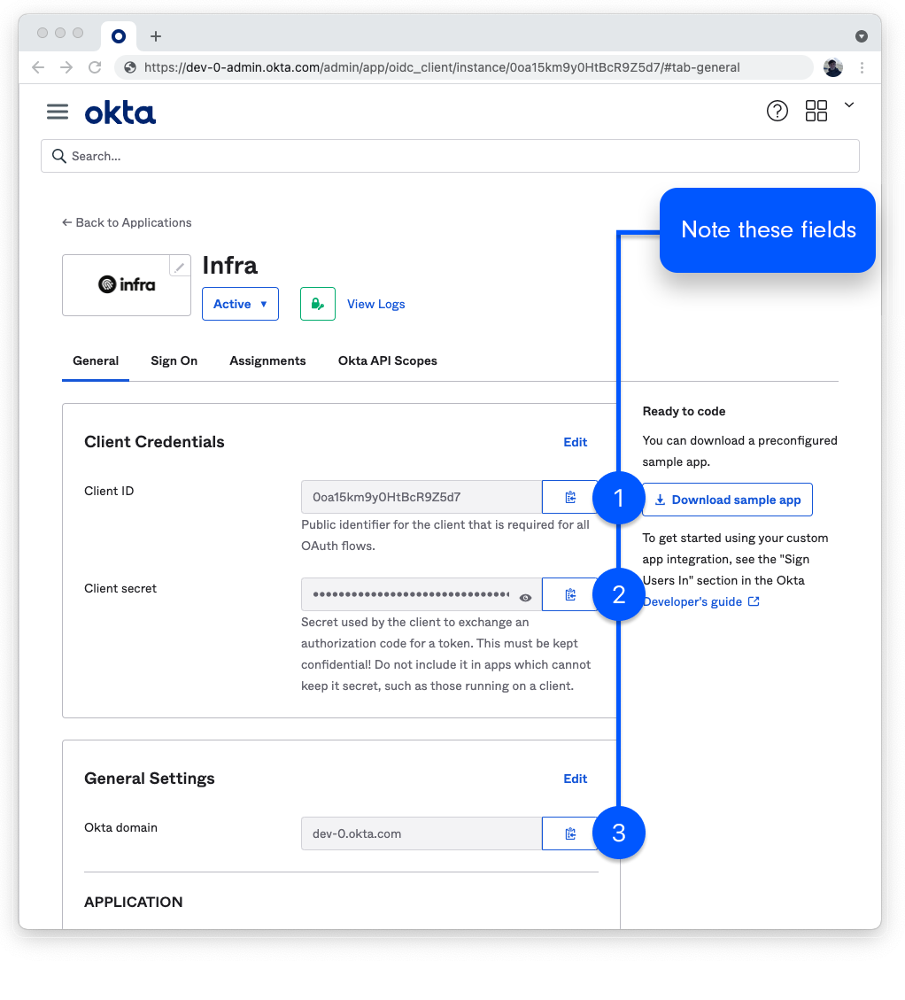

# Okta

## Connecting Okta

To connect Okta, run the following command:

```bash
infra providers add okta \
  --url <your okta url (or domain)> \
  --client-id <your okta client id> \
  --client-secret <your okta client secret>
```


## Finding required values

1. Login to the Okta dashboard.
2. Navigate to **Applications > Applications**


3. Create an Okta App:
   a. Click **Create App Integration**.
   b. Select **OIDC – OpenID Connect** and **Web Application**.
   c. Click **Next**.


4. Configure your new Okta App:
  - For **App integration name** write **Infra**.
  - Under **General Settings** > **Grant type** select **Authorization Code** and **Refresh Token**.
  - For **Sign-in redirect URIs** write:
    - `http://localhost:8301` (for CLI login)
    - `<your infra host>/login/callback` (for Dashboard login). Examples:
      - `https://infra.company.internal/login/callback` (hosting infra at `infra.company.internal`)
      - `http://localhost/login/callback` trying out Infra locally

5. For **Assignments** select the groups which will have access through Infra.

Click **Save**.

6. On the **General** tab, **note** the **Client ID**, **Client Secret**, and **Okta domain** for adding your Okta information to Infra later.


7. While still on the screen for the application you just created navigate to the **Sign On** tab.
   On the **OpenID Connect ID Token** select **Edit**.
   Update the **Groups claim filter** to `groups` `Matches regex` `.*`.
   Click **Save**.

8. Copy the **URL**, **Client ID** and **Client Secret** values and provide them into Infra's Dashboard or CLI.

