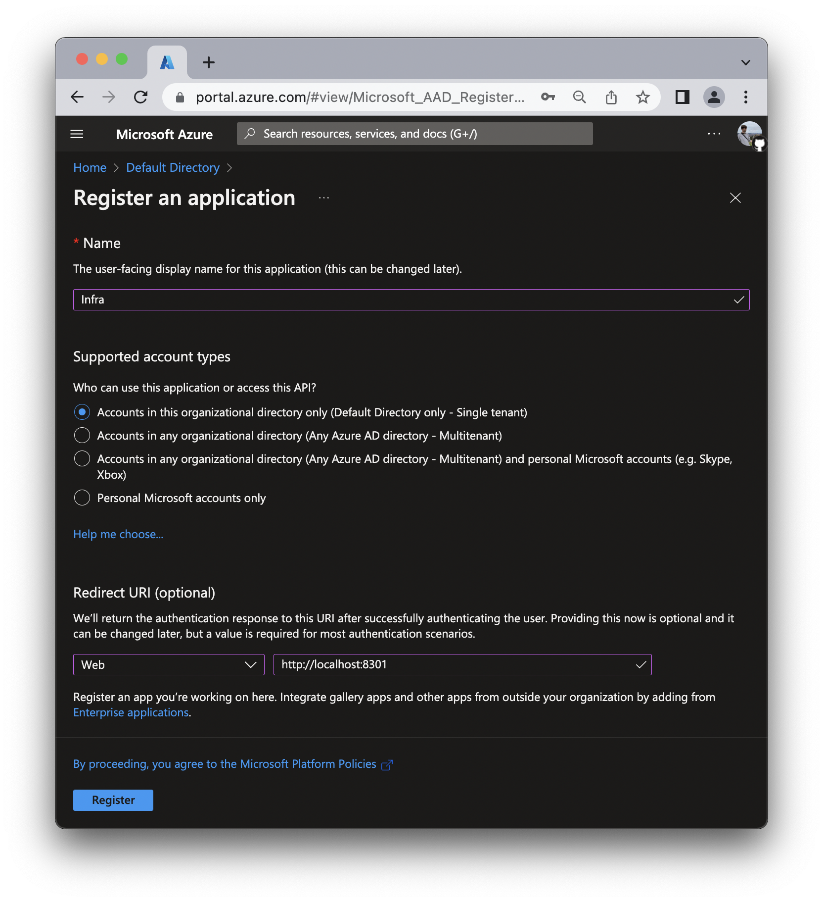
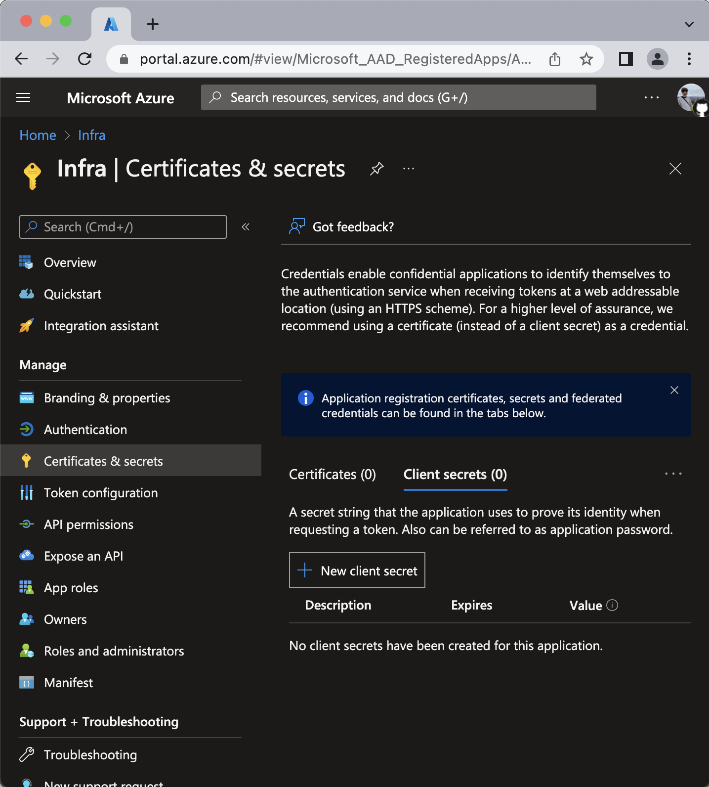
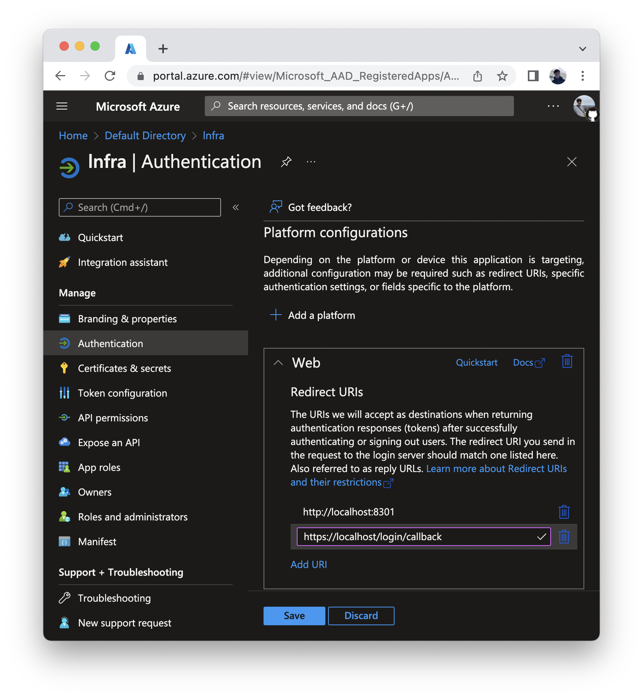
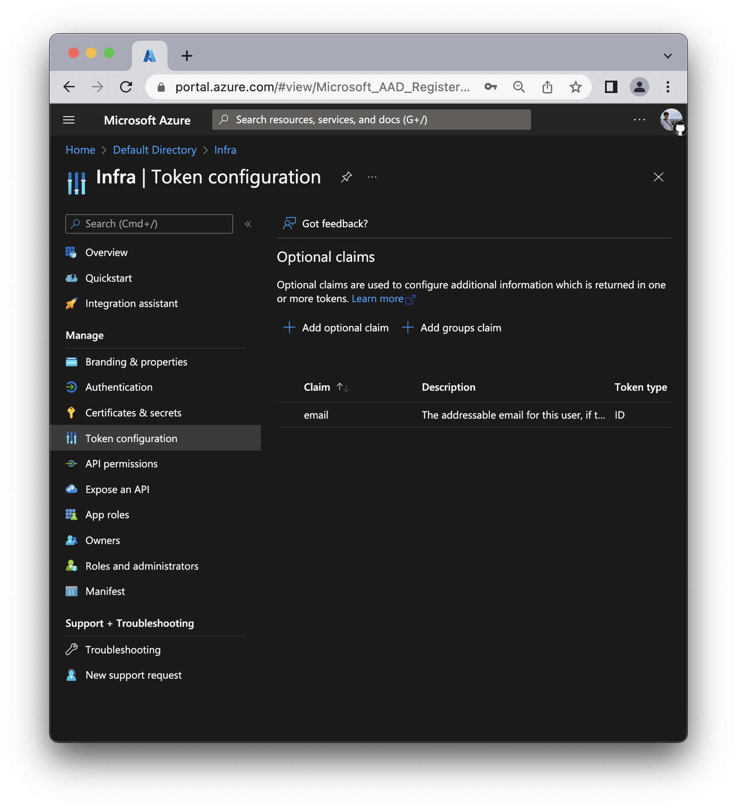
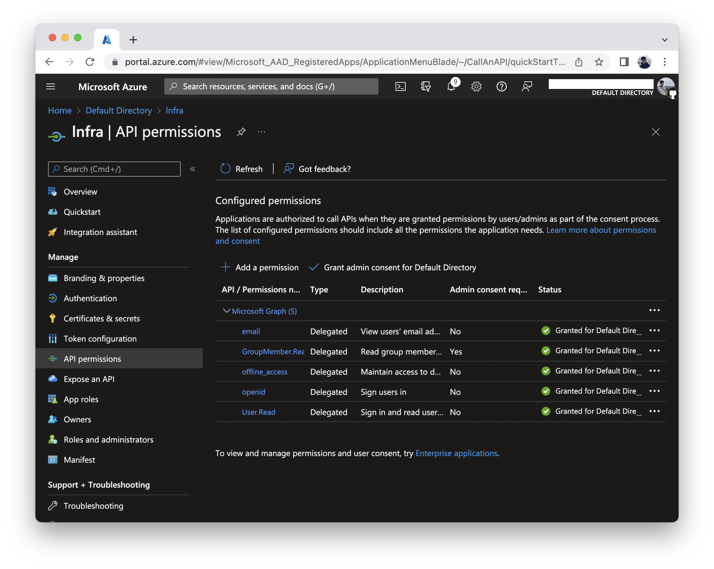

# Azure AD

## Connecting Azure
To connect Azure, run the following command:

```
infra providers add azure \
  --url login.microsoftonline.com/${TENANT_ID}/v2.0 \
  --client-id <your azure client id> \
  --client-secret <your azure client secret> \
  --kind azure
```

## Finding required values

1. Login to the Azure Portal.
2. Navigate to the **Azure Active Directory > App registrations**.

3. Click **New registration**.
4. Register the application:
    - For **Name** write **Infra**.
    - For **Redirect URI** select `Web` and add `http://localhost:8301`
    - Click **Register**.

5. On the **Overview** tab, click **Certificates & secrets > Client secrets**
    - Click **New client secret**.
    - In the **Add a client secret** pane select an expiry.
    - **Note** the **client secret value**.

6. Navigate to **Authentication**.
    - Select **Web** > **Add URI**.
    - Enter `https://<INFRA_SERVER_HOST>/login/callback`
    - Click **Save**.

7. Navigate to **Token configuration**.
    - Click **Add optional claim**.
    - For **Token type** select **ID**.
    - From the list of claims select the `email` claim.
    - Click **Add**.

8. Navigate to **API permissions**.
    - Click **Add a permission**.
    - Click **Microsoft Graph**.
    - Click **Delegated permissions**.
    - Select the following permissions:
        - **OpenId permissions** > **email**
        - **OpenId permissions** > **offline_access**
        - **OpenId permissions** > **openid**
        - **GroupMember** > **GroupMember.Read.All**
        - **User** > **User.Read**
    - Click **Add permissions**.
    - Click **Grant admin consent for Default Directory** and select **Yes** when prompted.

9. From the **Overview** tab copy the **Application (client) ID**, **Directory (tenant) ID**, and **Client Secret** values and provide them into Infra's Dashboard or CLI.

