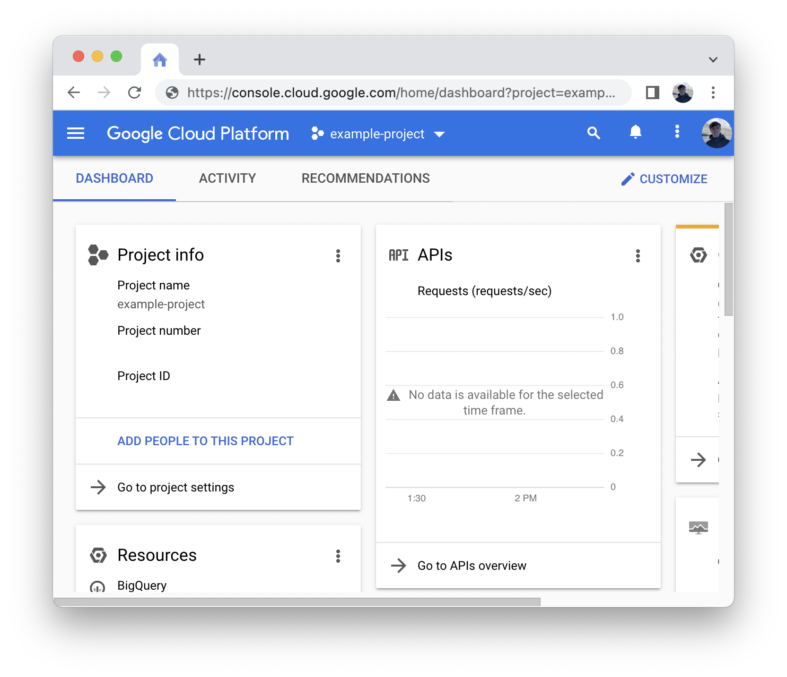
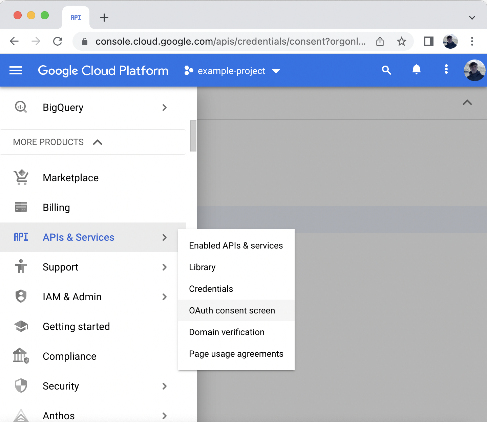
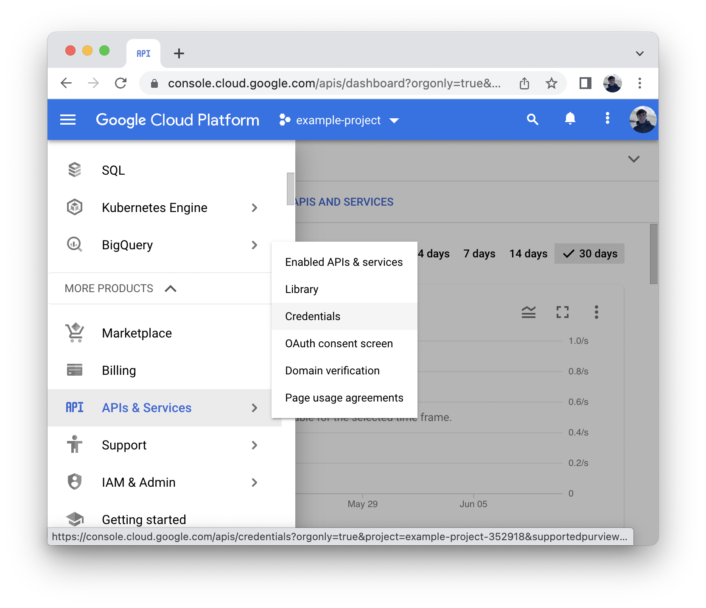
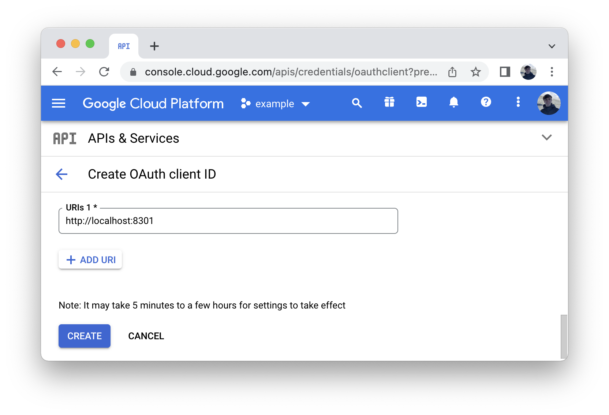
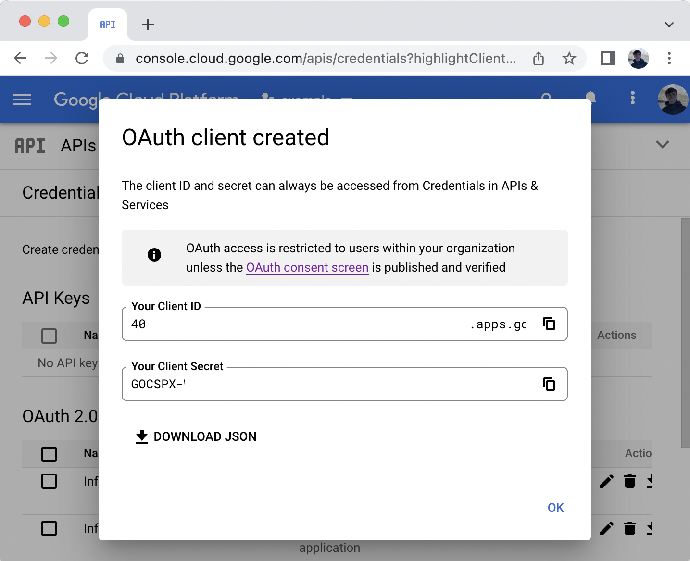
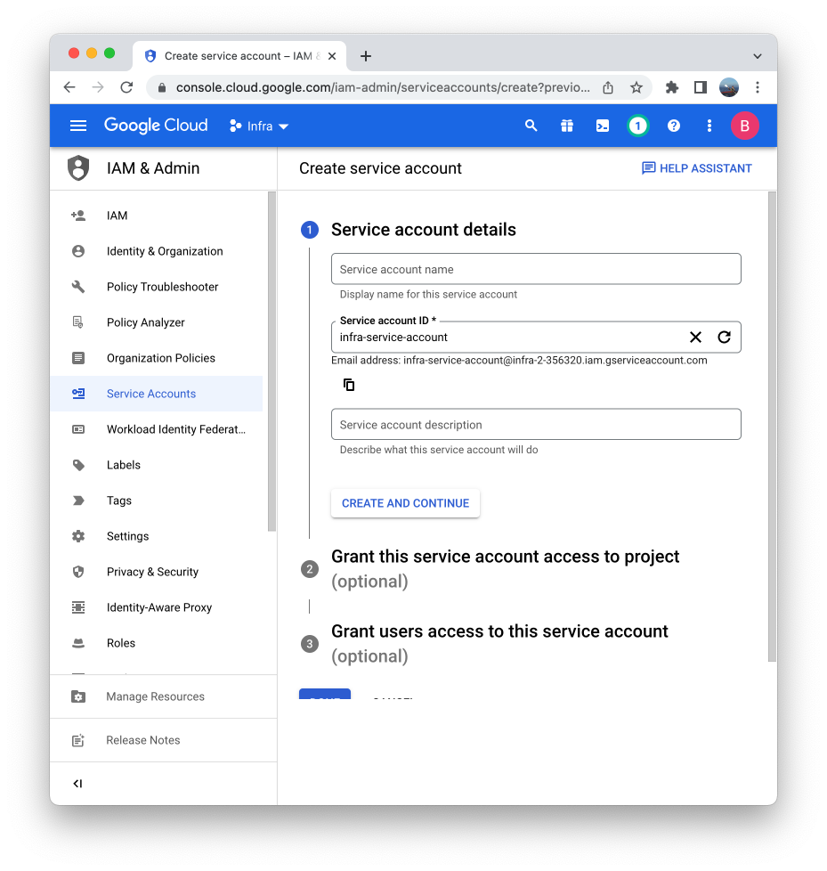
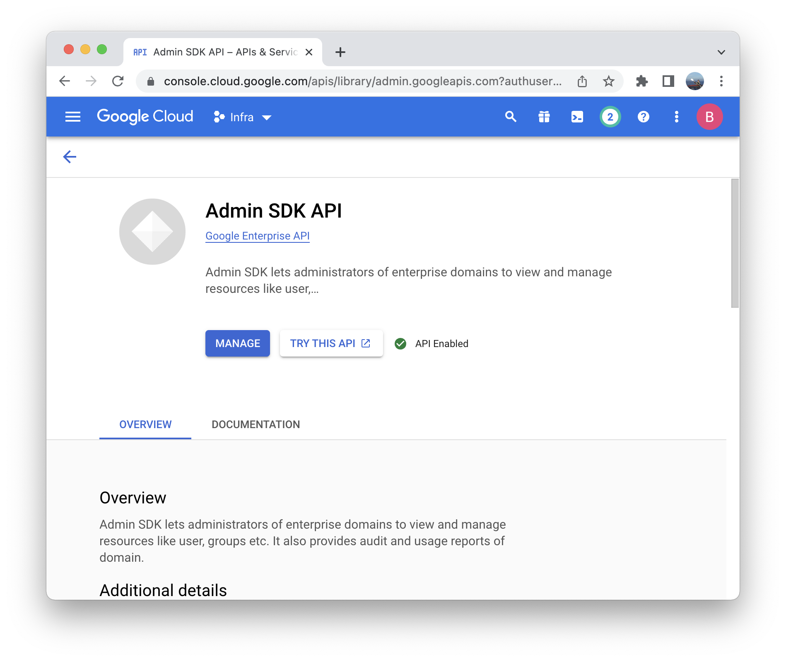
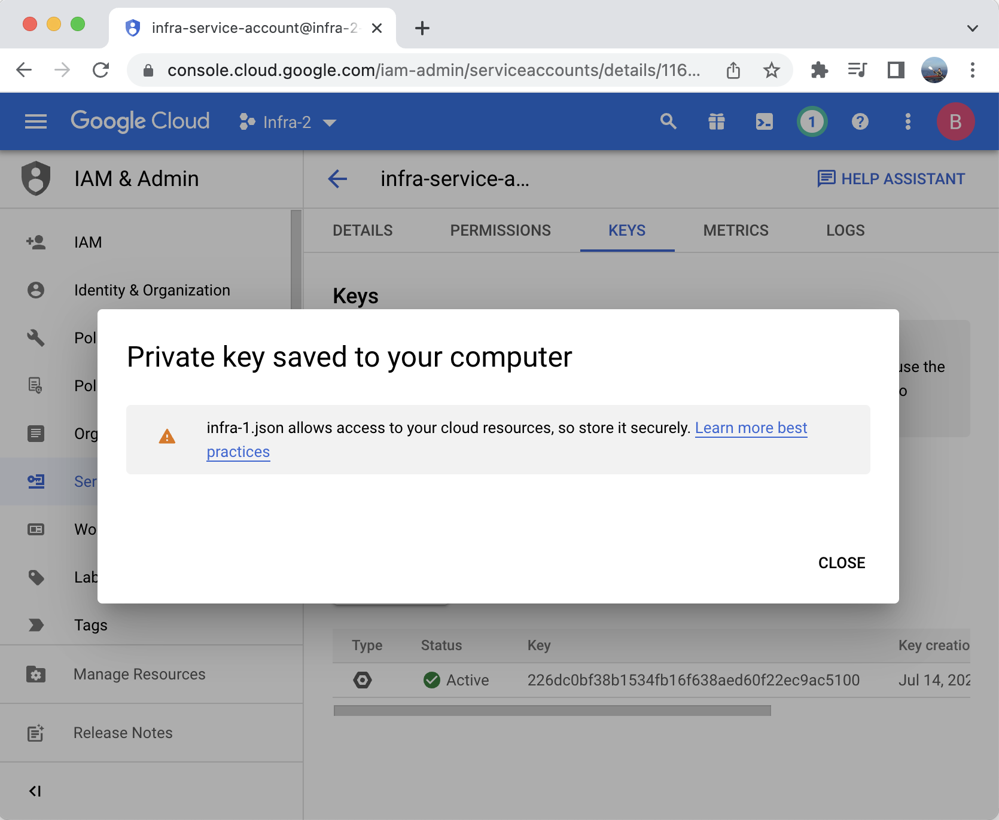
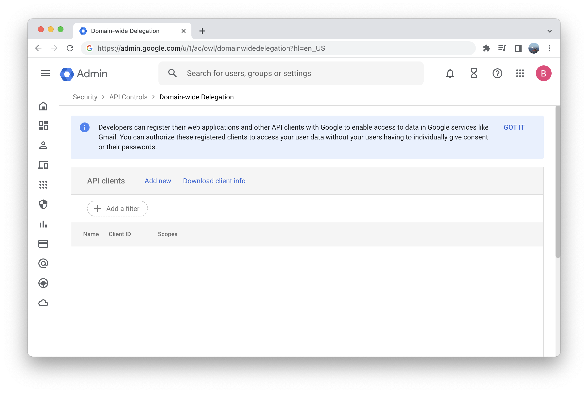

# Google

## Connecting Google

To connect Google, run the following command:

```
infra providers add google \
  --url accounts.google.com \
  --client-id <your google client id> \
  --client-secret <your google client secret> \
  --service-account-key <path to your google service account's private key file> \
  --workspace-domain-admin <your google workspace domain admin's email> \
  --kind google
```

## Finding required values

1. Login to the Google Cloud console.
2. Select the project you wish to create a client for or create a new project.
   
3. If you have not yet configured OAuth consent for this project navigate to the **APIs and Services > OAuth consent screen** dashboard.
   
   - For **User Type** select **Internal** to only allow users from your own organization to use the application.
   - Click **Create**.
   - For **App information** enter an **App name** and a **User support email**.
   - For **Developer contact information** enter an email.
   - Click **Save and continue**.
   - On the scopes page select **Add or remove scopes**. From the list of scopes select `.../auth/userinfo.email ` and `openid`. Scroll to the bottom of the selected scopes page and click **Update**.
   - Click **Save and continue**.
   - Verify your OAuth consent and click **Back to dashboard**.
     
4. Navigate to the **APIs and Services > Credentials** dashboard and click **Create credentials > OAuth client ID**.
   
   - For **Application type** select `Web application`.
   - For **Name** enter `Infra`.
   - Under **Authorized redirect URIs** select **Add URI** and add:
     1. `http://localhost:8301` (for Infra CLI login)
     2. `https://<INFRA_SERVER_HOST>/login/callback` (for Infra Dashboard login)
   - Click the **Create** button at the bottom of the page.
     
5. Note the **Client ID** and **Client Secret** fields.
   
6. Remaining on the **APIs and Services > Credentials** dashboard and click **Create credentials > Service account**.
   
   - Enter a **Service account ID** then click **Done**.
   - Click on the service account you just created to view the **Service account details**. Note the service account's **Unique ID**, this will be used in step 10.
7. Navigate to **APIs and Services > Enabled APIs & services**.

- Click **ENABLE APIS AND SERVICES**.
- Search for **Admin SDK API**.
- Click **Admin SDK API** in the results.
- Click **ENABLE**.
  

9. Navigate to **IAM & Admin > Service Accounts** click on the service account you just created and navigate to the **KEYS** tab.
   - Click **ADD KEY > Create new key**.
   - Select the **JSON** key type and click **CREATE**.
   - A private key JSON file will automatically download, note the **private_key** in this file. This will be the `service-account-key` in the `providers add` command.
     
10. You are now finished with configuration in the Google Cloud admin console. Open the Google Workspace admin console and navigate to **Security > Access and Data Controls > API Controls > Manage Domain-wide Delegation**.
    

- Click **Manage Domain Wide Delegation**
- Click **Add new**.
- For **Client ID** enter the service account's unique ID noted in step 6.
- For **OAuth scopes** enter **https://www.googleapis.com/auth/admin.directory.group.readonly**.
