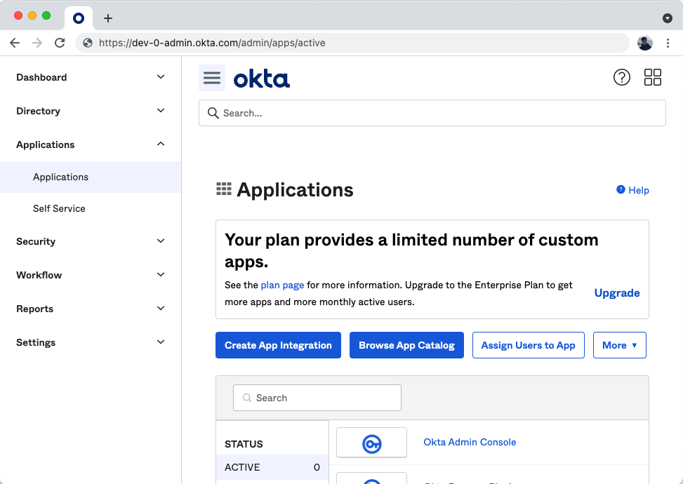
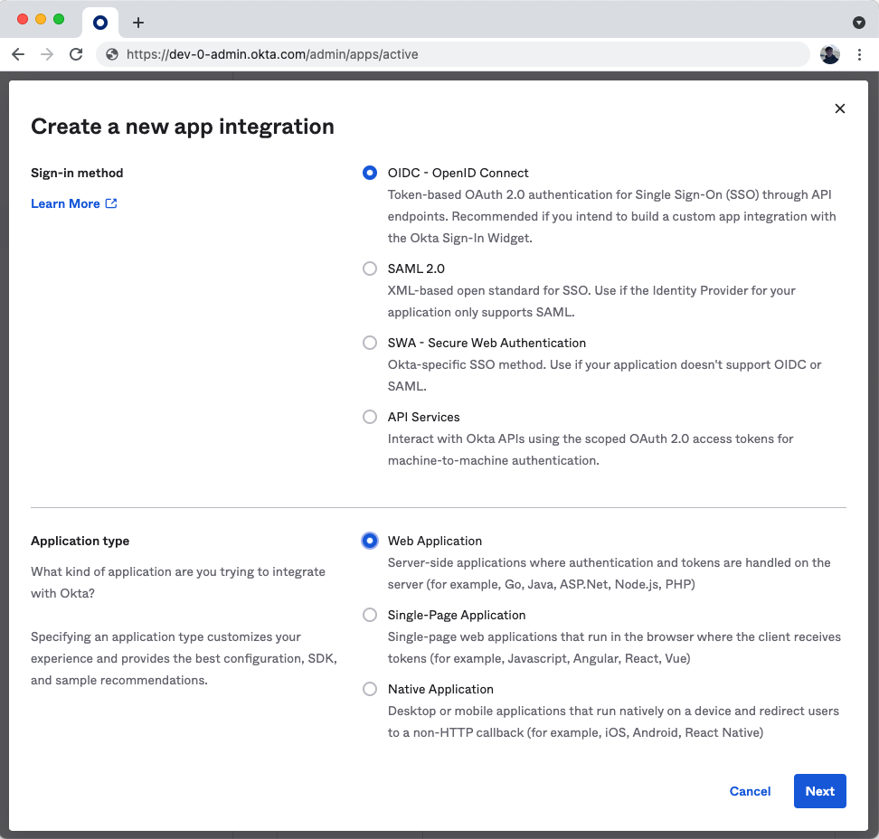
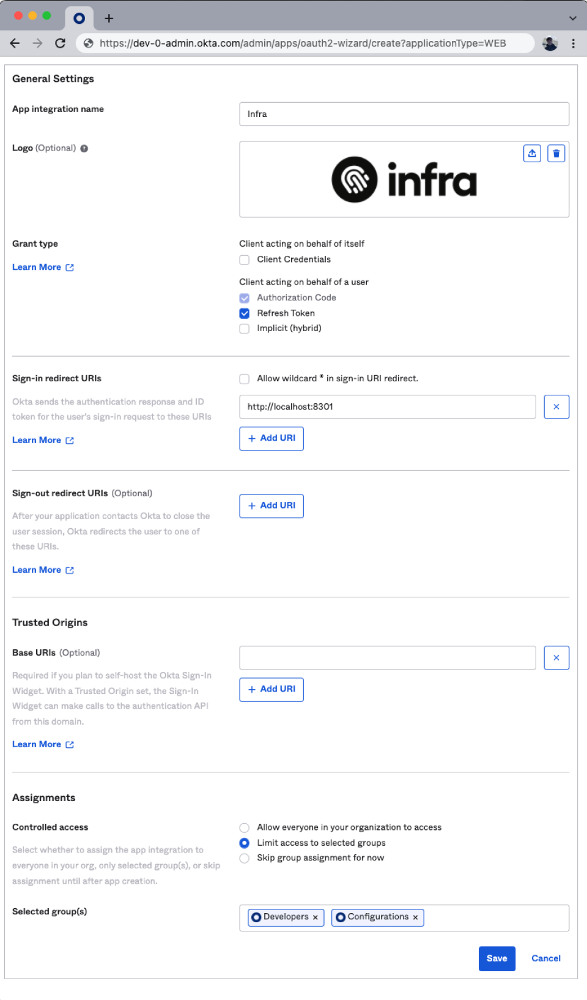
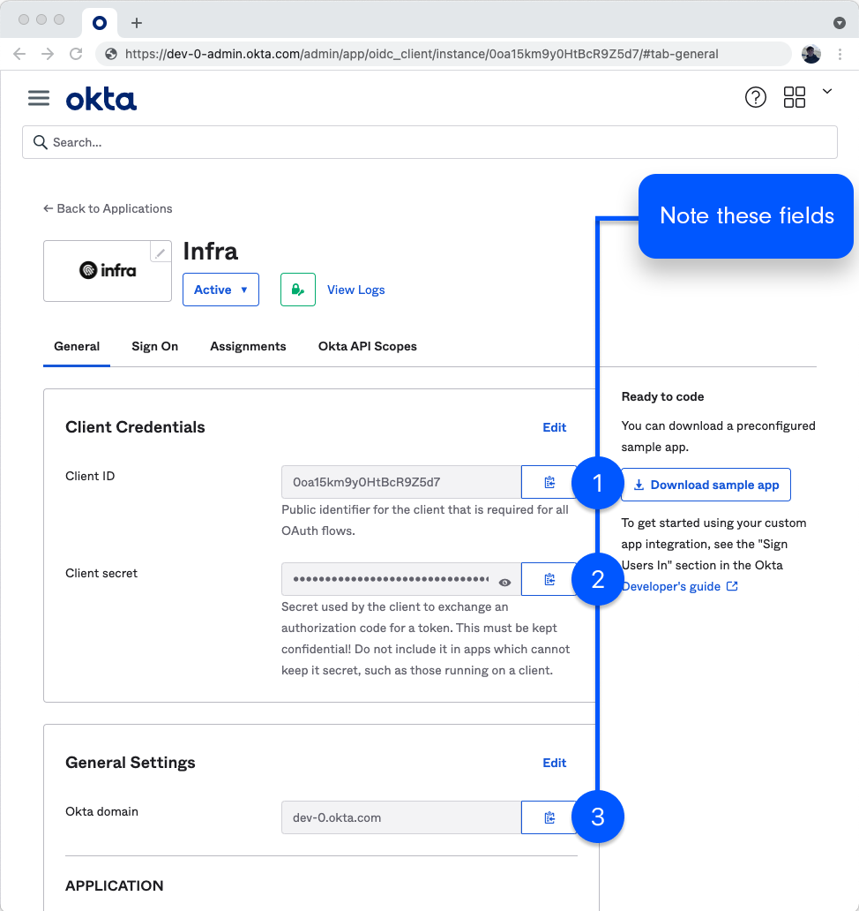

# Okta

## Connect Okta

To connect Okta, run the following `infra` command:

```
infra providers add okta \
  --url <your okta url (or domain)> \
  --client-id <your okta client id> \
  --client-secret <your okta client secret> \
  --kind okta
```

## Configure Okta

### Login to the Okta dashboard

Login to the Okta dashboard and navigate to **Applications > Applications**



### Create an Okta App:
  - Click **Create App Integration**.
  - Select **OIDC – OpenID Connect** and **Web Application**.
  - Click **Next**.



### Configure your new Okta App:
  - For **App integration name** write **Infra**.
  - Under **General Settings** > **Grant type** select **Authorization Code** and **Refresh Token**
  - For **Sign-in redirect URIs** add:
    1. `http://localhost:8301` (for Infra CLI login)
    2. `https://<INFRA_SERVER_HOST>/login/callback` (for Infra Dashboard login)
  - For **Assignments** select the groups which will have access through Infra

Click **Save**.



While still on the screen for the application you just created navigate to the **Sign On** tab.
  - On the **OpenID Connect ID Token** select **Edit**
  - Update the **Groups claim filter** to `groups` `Matches regex` `.*`
  - Click **Save**

### Copy important values

Copy the **URL**, **Client ID** and **Client Secret** values and provide them into Infra's Dashboard or CLI.


