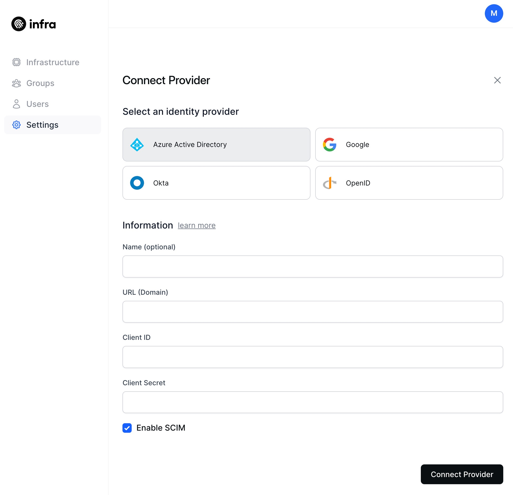
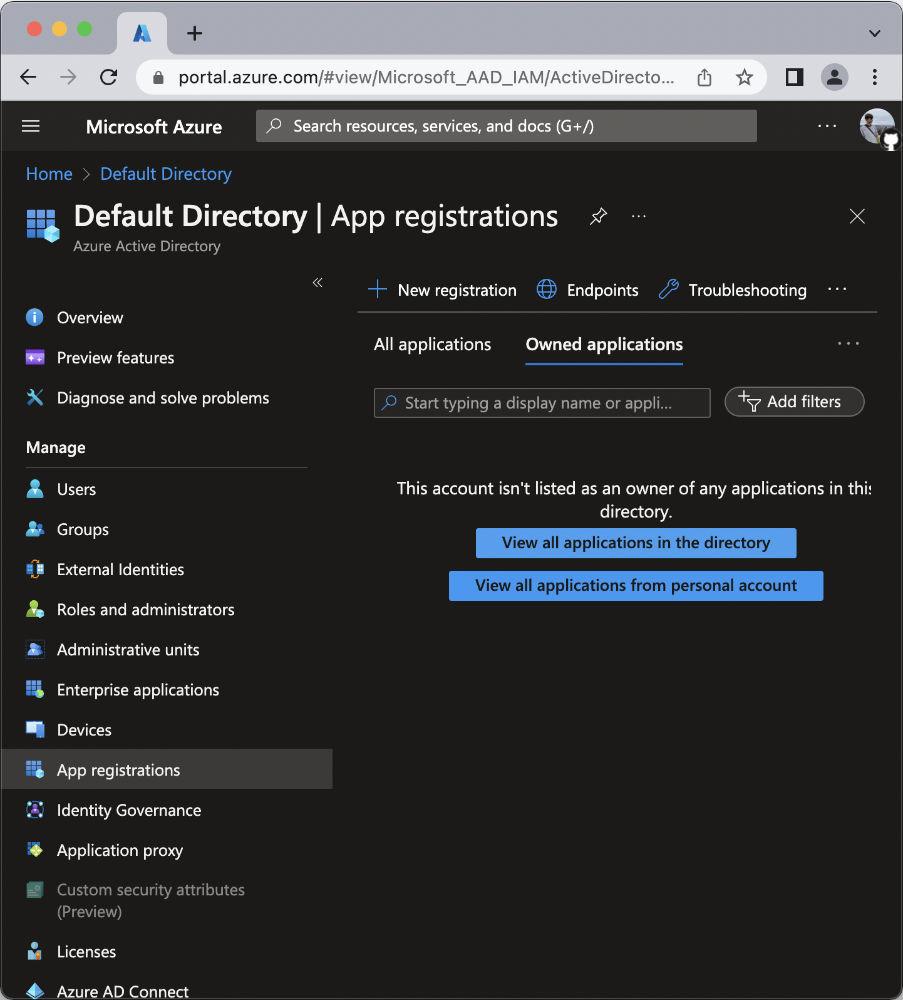
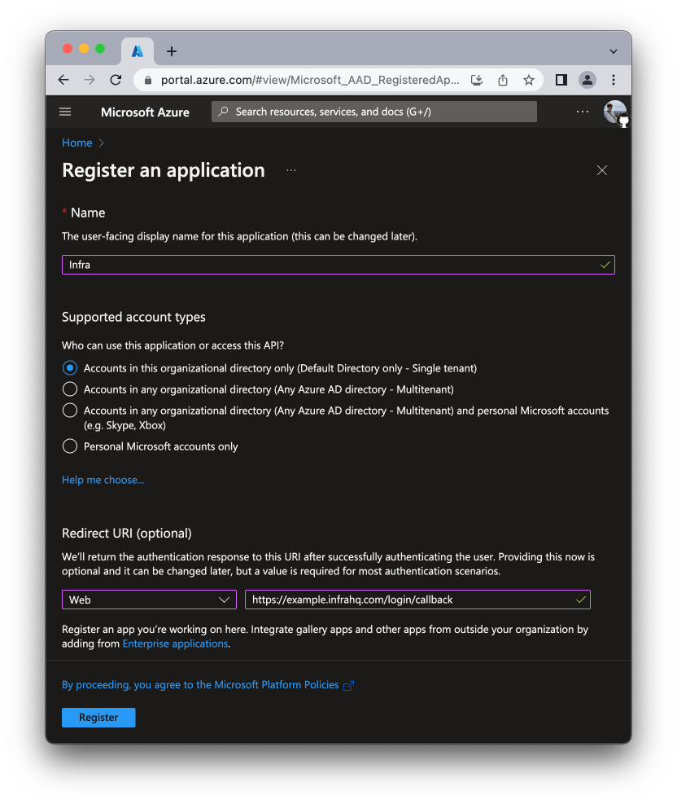
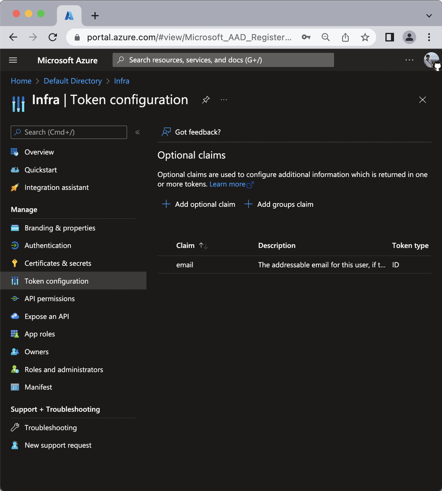
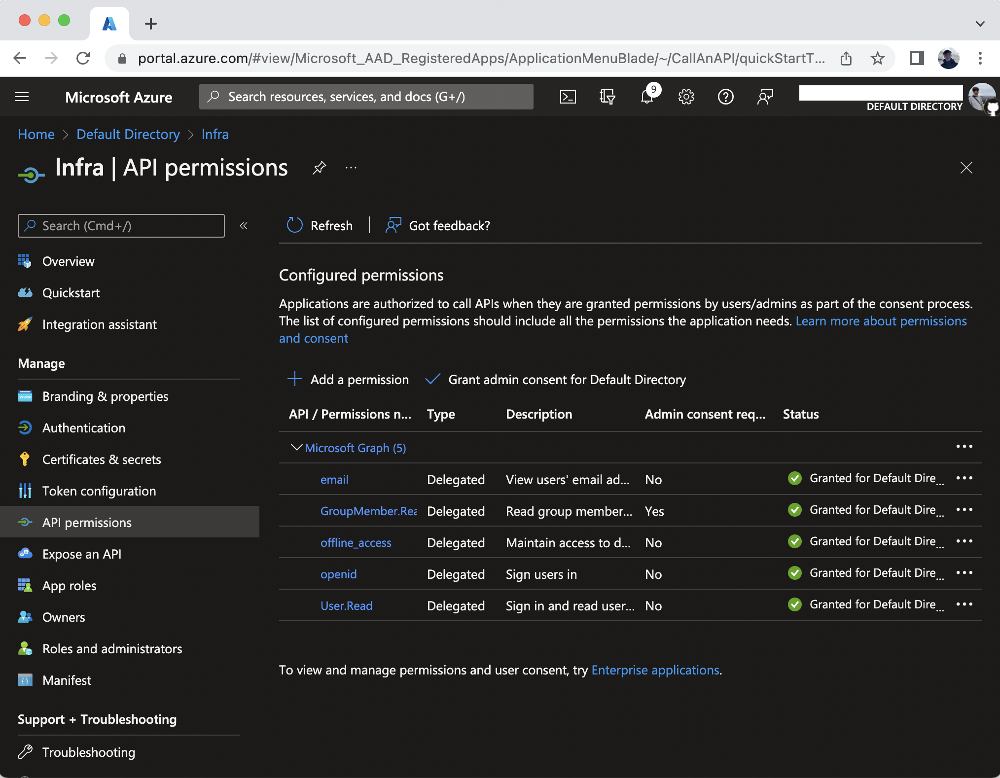

# Azure Active Directory

This guide connects Microsoft Azure active directory to Infra as an identity provider.

## Connect

### CLI

To connect Azure active directory via Infra's CLI, run the following command:

```shell
infra providers add azure \
  --url login.microsoftonline.com/${TENANT_ID}/v2.0 \
  --client-id <your azure client id> \
  --client-secret <your azure client secret> \
  --kind azure
```

### Dashboard

To connect Azure active directory via Infra's Dashboard, navigate to `Settings`, select `Providers`, click on `Connect provider` and fill in the required values.



## Finding required values

1. Login to the Azure Portal.
2. Navigate to the **Azure Active Directory > App registrations**.
   
3. Click **New registration**
4. Register the application:
   - For **Name** write **Infra**
   - For **Redirect URI** select `Web` and add `https://<your infra host>/login/callback`
   - Click **Register**
     > If supporting an `infra` CLI version lower than `0.19.0`, also add `http://localhost:8301` as a redirect URI.
     
5. On the **Overview** tab, click **Certificates & secrets > Client secrets**
   - Click **New client secret**. - **Description** field is optional.
   - In the **Add a client secret** pane select an expiry. (Note: you will need to generate a new client secret after expiry).
   - **Note** the **client secret value**.
     
6. Navigate to **Token configuration**
   - Click **Add optional claim**.
   - For **Token type** select **ID**.
   - From the list of claims select the `email` claim.
   - Click **Add**.
      - If prompted to "Turn on the Microsoft Graph email permission (required for claims to appear in token)", please add it. (You will also add it in the next step.)
7. Navigate to **API permissions**.
   - Click **Add a permission**
   - Click **Microsoft Graph**
   - Click **Delegated permissions**
   - Select the following permissions:
     - **OpenId permissions** > **email**
     - **OpenId permissions** > **offline_access**
     - **OpenId permissions** > **openid**
     - **GroupMember** > **GroupMember.Read.All**
     - **User** > **User.Read** - Click **Add permissions**.
     - Click **Grant admin consent for Default Directory** and select **Yes** when prompted.
       
8. From the **Overview** tab copy the **Application (client) ID**, **Directory (tenant) ID**, and **Client Secret** values and provide them into Infra's Dashboard or CLI.
