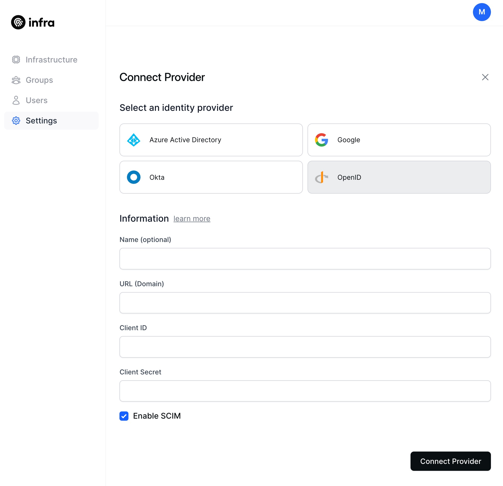

# OpenID Connect (OIDC)

This guide connects an OpenID connect compliant identity provider to Infra.

## Connect

### CLI

To connect an OIDC identity provider via Infra's CLI, run the following command:

```bash
infra providers add <your oidc provider name> \
  --url <your_oidc_provider_url_or_domain> \
  --client-id <your_oidc_client_id> \
  --client-secret <your_oidc_client_secret> \
  --kind oidc
```

### Dashboard

To connect an OIDC identity provider via Infra's Dashboard, navigate to `Settings`, select `Providers`, click on `Connect provider` and fill in the required values.



## Finding required values

### OIDC Provider Name

This can be any value you desire. It is used as a name in Infra to refer to this identity provider.

### OIDC Provider URL

The base URL your OIDC identity provider can be reached at to obtain information and perform authentication.

Infra relies on the [/.well-known/openid-configuration](https://openid.net/specs/openid-connect-discovery-1_0.html#ProviderConfig) endpoint to discover the paths needed to use the identity provider.

For example, if your OIDC provider's discovery endpoint is `https://oidc.example.com/.well-known/openid-configuration` then your OIDC provider URL would be `oidc.example.com`.

### OIDC Client ID and Secret

In order to authenticate using an OIDC identity provider you must register Infra as a client in that identity provider. By registering Infra as a client it will be granted a client ID and client secret that it can use to authenticate users.

#### OIDC Client Configuration Requirements

- Infra uses the [authorization code flow](https://openid.net/specs/openid-connect-core-1_0.html#CodeFlowAuth), typically clients that use this flow are **web applications**.
- Scopes required:
  - `openid`
  - `email`
- Redirect URIs:
  - `https://<your infra host>/login/callback`

> If supporting an `infra` CLI version lower than `0.19.0`, also add `http://localhost:8301` as a redirect URI.

## Additional Requirements

- The OIDC identity provider must support the [UserInfo](https://openid.net/specs/openid-connect-core-1_0.html#UserInfo) endpoint.
- The UserInfo response **must** contain either a `name` or `email` field.
- If you wish to use groups, the identity provider **must** return the user's assigned groups from the UserInfo endpoint.
