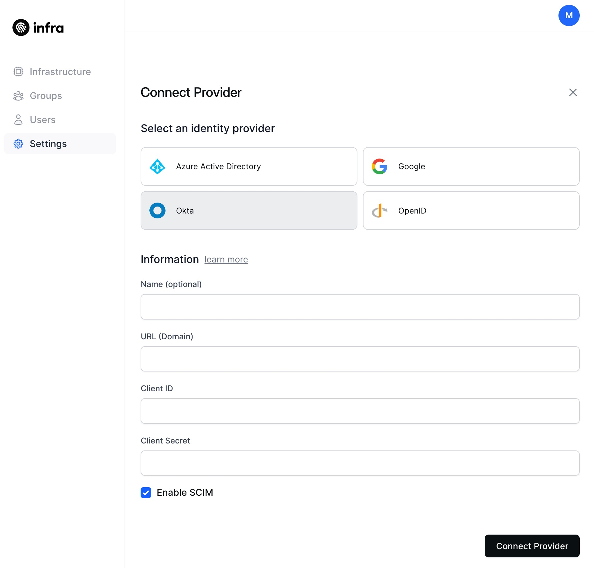
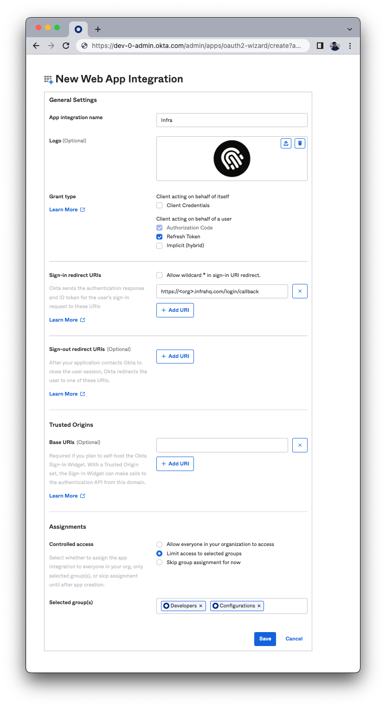

# Okta

This guide connects Okta to Infra as an identity provider.

## Connect

### CLI

To connect Okta via Infra's CLI, run the following command:

```bash
infra providers add okta \
  --url <your_okta_url_or_domain> \
  --client-id <your_okta_client_id> \
  --client-secret <your_okta_client_secret> \
  --kind okta
```

### Dashboard

To connect Okta via Infra's Dashboard, navigate to `Settings`, select `Providers`, click on `Connect provider` and fill in the required values.



## Finding required values

### Login to the Okta dashboard

Login to the Okta dashboard and navigate to **Applications > Applications**


### Create an Okta App

- Click **Create App Integration**.
- Select **OIDC - OpenID Connect** and **Web Application**.
- Click **Next**.


### Configure your new Okta App

- For **App integration name** write **Infra**.
- Under **General Settings** > **Grant type** select **Authorization Code** and **Refresh Token**
- For **Sign-in redirect URIs** add `https://<your infra host>/login/callback`
- For **Assignments** select the groups which will have access through Infra

> If supporting an `infra` CLI version lower than `0.19.0`, also add `http://localhost:8301` as a redirect URI on this screen.

Click **Save**.



While still on the screen for the application you just created navigate to the **Sign On** tab.

- On the **OpenID Connect ID Token** select **Edit**
- Update the **Groups claim filter** to `groups` `Matches regex` `.*`
- Click **Save**

### Copy important values

Copy the **URL**, **Client ID** and **Client Secret** values and provide them into Infra's Dashboard or CLI.


