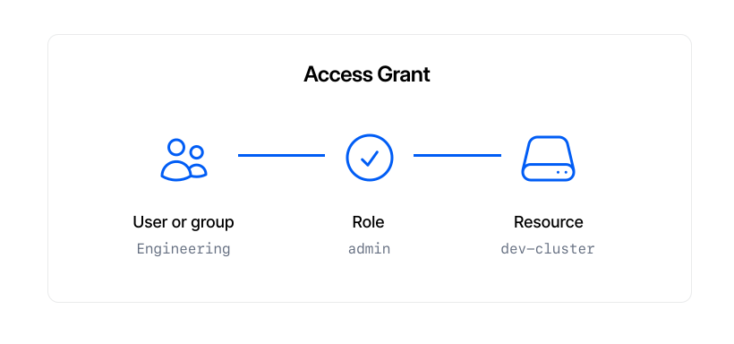

# Access Control

**Access control** is a powerful system for managing user and group access in a single place. Updates are applied near-instantly (within seconds) to destination infrastructure, making it possible to escalate and revoke a user's access on-demand.

## Overview

Access is managed via **Access Grants**. These records determine determine _who_ can access _what_ with which _permission or role_. Grants tie three components together to enable access:

- A user or group (e.g. `jeff@acme.co`)
- A role (e.g. `admin`)
- A resource (e.g. `dev-cluster`)



### Roles

Infra allows granting different levels of access via **roles**, such as `view`, `edit` or `admin`. Different infrastructure destinations support different roles. For example, view a list of [roles](../integrations/kubernetes.md#roles) supported by Kubernetes.

### Resources

A **resource** is an infrastructure resource managed by Infra. Examples include:

- A Kubernetes cluster (e.g. `dev-cluster`)
- A Kubernetes namespace (e.g. `dev-cluster.kube-system`)

## Granting access

### CLI

To grant access, use `infra grants add`. Note: the user you grant access to must already exist. To grant a user the `edit` role on a cluster named `staging` run:

```bash
infra grants add user@example.com staging --role edit
```

Note: the same command can be used to grant access to a group using the boolean `--group` flag:

```bash
infra grants add --group engineering staging --role edit
```

### Dashboard

Navigate to **Infrastructure** in the Dashboard. Choose the cluster you want to grant access to. Enter an email address in the text box. As you type, you will filter down the list of all users available in the dropdown. Select the user you want to grant access to. Now choose the role you want to grant to the user. Click the **+ Add** button to add the grant. This has granted the chosen role to the chosen user for the entire cluster.


To grant access to a particular namespace, select the **Namespaces** tab and then select a namespace. Then use the same procedure to grant access just to a particular namespace.

## Revoking access

### CLI

To revoke access, use `infra grants remove`:

```bash
infra grants remove user@example.com staging --role edit
```

### Dashboard

Navigate to **Infrastructure** and choose the cluster you want to revoke access from. If revoking from a namespace, choose the namespace. Each user has a dropdown on the right where you can select a new role, or click **x Remove** at the bottom of the list.


## Inspecting access

### CLI

```console
infra grants list
  USER                 ROLE     DESTINATION
  jeff@infrahq.com     edit     development
  michael@infrahq.com  view     production

  GROUP          ROLE      DESTINATION
  Engineering    edit      development.monitoring
  Engineering    view      production
  Design         edit      development.web
```

### Dashboard

Navigate to **Infrastructure** and choose the cluster you want to view. Under **Access**, you will see a list of users that have access to the cluster. You can also change their roles from here. To see users that can access a namespace, select the **Namespace** tab and select the namespace. You will then see the list of users that have access to that namespace.

