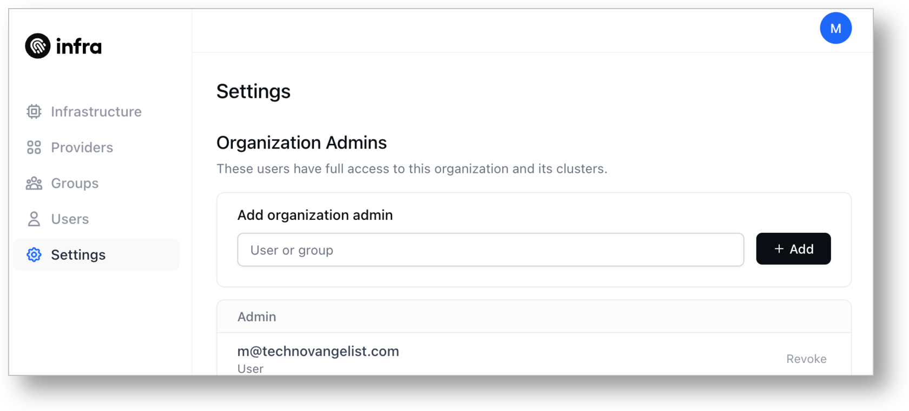
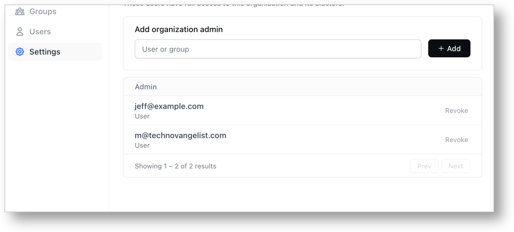

# Managing Infra Admins

## Built-in Infra Roles

Infra has built-in roles for promoting users to manage Infra.

- **admin**: Full admin access to Infra
- **view**: Read-only access to Infra

## Promoting a user to an Infra admin

This will provide `admin@example.com` full access to the Infra API, including creating additional grants, managing identity providers, managing destinations, and managing other users.



Navigate to **Settings**. Enter an existing user email into the textbox and click the **+ Add** button.




```
infra grants add admin@example.com infra --role admin
```




## Setting a group to an Infra admin



Navigate to **Settings**. Enter an existing group into the textbox and click the **+ Add** button.




```
infra grants add --group engineering infra --role admin
```




## Revoking admin access



Navigate to **Settings**. Click **Revoke** on the right side of one of the existing Admin users or groups.




```
infra grants remove admin@example.com infra --role admin
```



