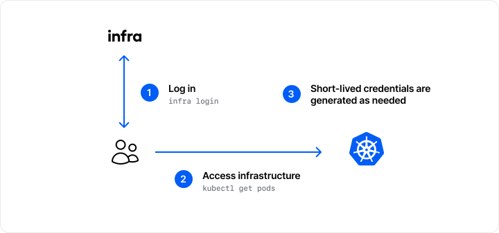
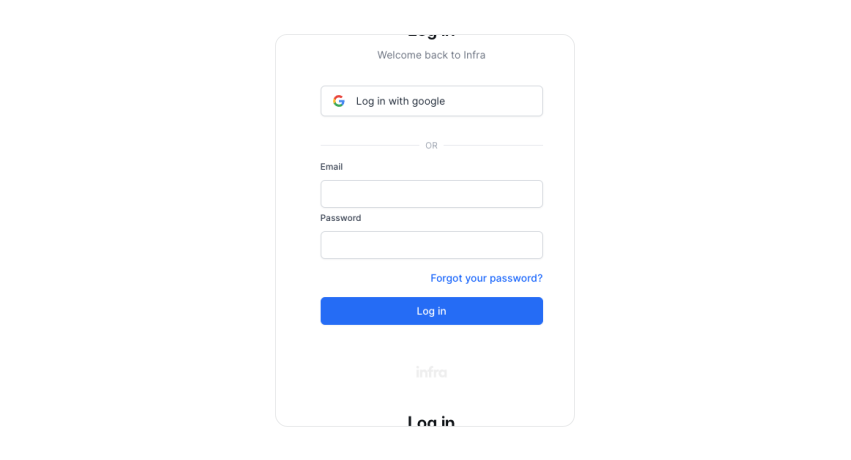
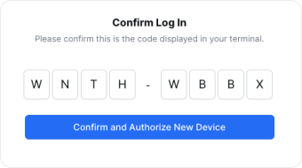

# Authentication

**Authentication** enables infrastructure access without the need for static secrets, keys or shared passwords. Instead, users log in with an [authentication method](#authentication-methods), and short-lived credentials are distributed to users automatically.



## Logging in

Users authenticate by [downloading](../download.md) the Infra CLI and then log in via their terminal:

```
infra login
```

`infra login` prompts users to log in via different [authentication methods](#authentication-methods). For authentication methods that require a browser, Infra will direct users to a login page in their browser:



After logging in, Infra automatically updates local configuration files with the required short-lived credentials for access.

## Authentication Methods
Users may log in to Infra using a web browser or via the CLI.

### Browser

Navigate to `<your infra host>/login` in a web browser.

### CLI

Run the `infra login` command.
```
infra login <your infra host>
```

Users are will be prompted to log in via a web browser:

```
Navigate to https://<your infra host>/device?code=WNTH-WBBX and enter the following code:

		WNTH-WBBX
```



### Access Keys

Access Keys are a built-in authentication method. To log in using an access key, set the `INFRA_SERVER` and `INFRA_ACCESS_KEY` environment variables:

```
export INFRA_SERVER=<your infra host>
export INFRA_ACCESS_KEY=<xxxxxxxxxxxx.yyyyyyyyyyyyyyyyyyyyyyyyyyy>
```

Then, run `infra login`:

```
infra login
```

Access keys can be created by [logging in](https://login.infrahq.com) to the Infra dashboard and clicking **Settings**.

### Google

In order for a user to log into your organization using Google they must either have been manually added as a user by an administrator or have a Google account with an email that matches the organization's allowed domains. Allowed email domains can be configured in "settings > authentication".

> Note: When users log in using Google they will not have access to any infrastructure by default. They must be directly granted access by an administrator. 

### Custom Identity Providers

Infra supports logging in using custom identity providers such as your own Google Workspace client and Okta. To configure a custom identity provider, refer to the individual guides for each provider below:

- [Google](../identity/google.md)
- [Okta](../identity/okta.md)
- [Azure AD](../identity/azure-ad.md)
- [Custom OIDC Provider](../identity/oidc.md)

After configuring an identity provider, users will be able to authenticate with it when running `infra login`.
