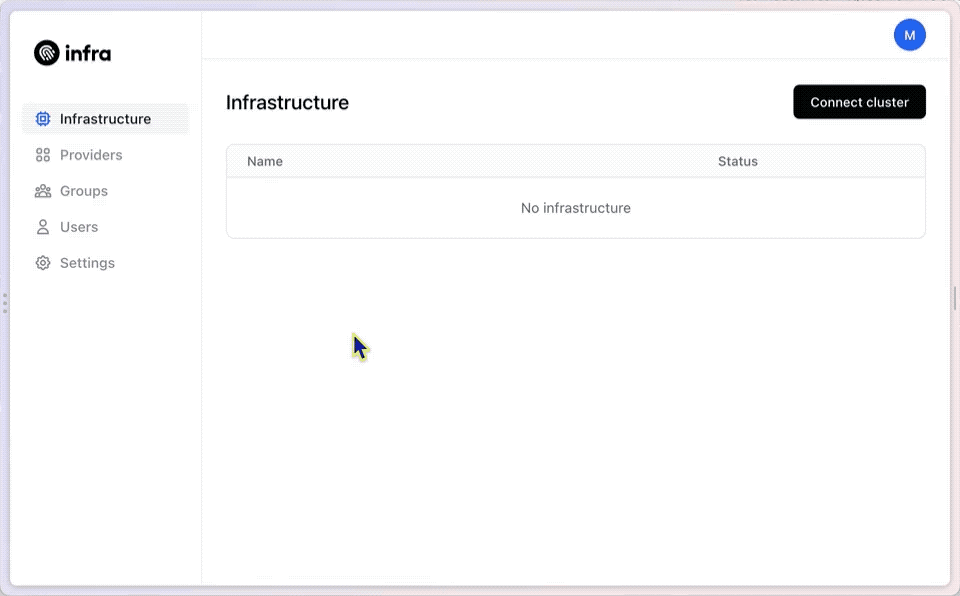

# Kubernetes

## Connecting a cluster







Navigate to the **Infrastructure** tab in the dashboard and click the **Connect cluster** button.

Enter a **Cluster name** in the text box.

Copy the commands shown. They will add the Helm repo and update it, and then install the Infra Connector onto the cluster. Ensure you are connected to the appropriate Kubernetes cluster, and then paste the commands into your terminal to connect Infra to your cluster.




First, generate an access key:

```shell
ACCESS_KEY=$(infra keys add --connector -q)
```

Next, use this access key to connect your cluster:

```shell
helm upgrade --install infra-connector infrahq/infra \
    --set connector.config.server=INFRA_SERVER_HOSTNAME \
    --set connector.config.accessKey=$ACCESS_KEY \
    --set connector.config.name=example-cluster-name
```






Note: it may take a few minutes for the LoadBalancer resource to be provisioned.

If your load balancer does not have a hostname (often true for GKE and AKS clusters), Infra will not be able to automatically create a TLS certificate for the server. On GKE, you can use the hostname `<LoadBalancer IP>.bc.googleusercontent.com`.

Otherwise, you'll need to configure the load balancer with a static IP and hostname (see
[GKE docs](https://cloud.google.com/kubernetes-engine/docs/tutorials/configuring-domain-name-static-ip), or
[AKS docs](https://docs.microsoft.com/en-us/azure/aks/static-ip#create-a-static-ip-address)).
Alternatively you can use the `--skip-tls-verify` with `infra login`, or set up your own TLS certificates for Infra.



## Using a Helm Values File

Although you can install the Connector with the single command that you used, we recommend that for production use you leverage a Helm values file. You can review the full details about this in the [Helm Reference](../../reference/helm.md).

Here is a sample Helm values file you might want to start with, replacing the

```yaml
connector:
  config:
    ## Infra server access key. You can get this by running
    ## infra keys add --connector --name connectorname --ttl=87600h
    accessKey: "XXXXXXXXXX.YYYYYYYYYYYYYYYYYYYYYYYY"
    ## Infra server address
    server: "api.infrahq.com"
    ## Destination name. This is the name that will appear in the UI and CLI
    name: "your-kubernetes"
  service:
    annotations:
      # If using AWS EKS
      # service.beta.kubernetes.io/aws-load-balancer-healthcheck-protocol: HTTPS
      # service.beta.kubernetes.io/aws-load-balancer-healthcheck-path: /healthz

      # If using Azure AKS
      # service.beta.kubernetes.io/azure-load-balancer-health-probe-protocol: https # Kubernetes 1.20+
      # service.beta.kubernetes.io/azure-load-balancer-health-probe-request-path: healthz # Kubernetes 1.20+

      # If using Digital Ocean
      # service.beta.kubernetes.io/do-loadbalancer-healthcheck-protocol: https
      # service.beta.kubernetes.io/do-loadbalancer-healthcheck-path: /healthz
```

## Next Steps

Once you've connected a cluster, you can grant access via `infra grants add` or using the Dashboard. [Learn more about Grants in Infra](../grants.md).
