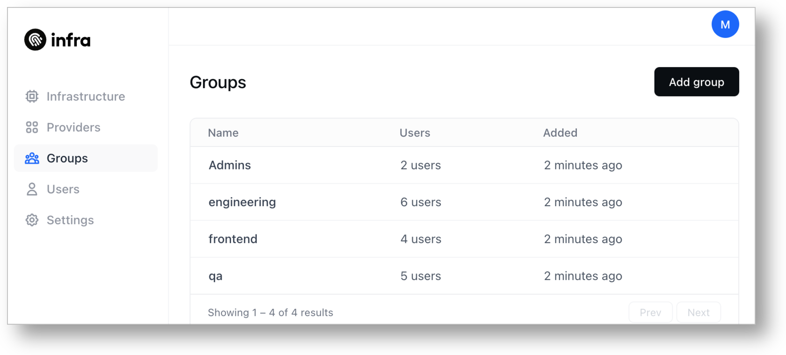
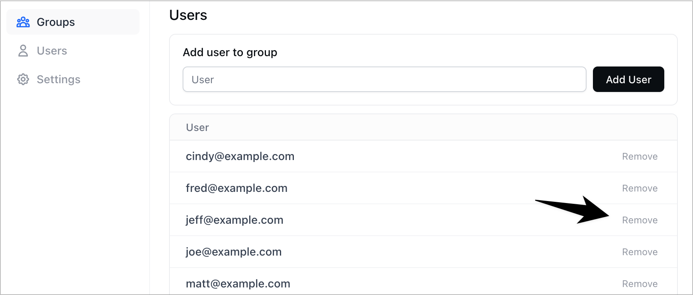

# Working with Groups

## Listing groups



Navigate to **Groups**. All the groups managed by Infra will be shown.



To see all groups managed by Infra including both Infra managed groups and Identity Provider Provided groups, use `infra groups list`:

```bash
infra groups list
```

You'll see the resulting list of groups with each of its users:

```bash
NAME        LAST SEEN
developers  alice@infrahq.com, bob@infrahq.com
design      carol@infrahq.com, david@infrahq.com
everyone    alice@infrahq.com, bob@infrahq.com, carol@infrahq.com
            david@infrahq.com
```




## Creating a new group



Navigate to **Groups** and click the **Add group** button.


To add a new group, use `infra groups add`:

```bash
infra groups add developers
```




## Removing a group



Navigate to **Groups** and choose a group. Click the **Remove Group** button at the top.




To remove a group, use `infra groups remove`:

```bash
infra groups remove developers
```




## Adding a user



Navigate to **Groups** and click on a group. Enter a user email in the text box and click the **Add User** button.


To add a user to a group, use `infra groups adduser`:

```bash
infra groups adduser example@acme.com
```




## Removing a user



Navigate to **Groups** and click on a group. Click **Remove** to the right of any user.



To remove a user from a group, use `infra groups removeuser`:

```bash
infra groups removeuser example@acme.com developers
```



