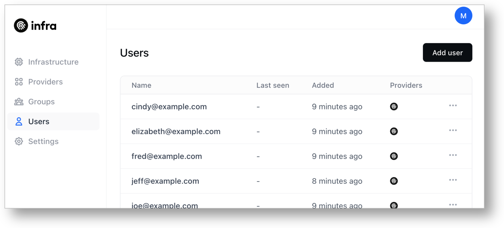
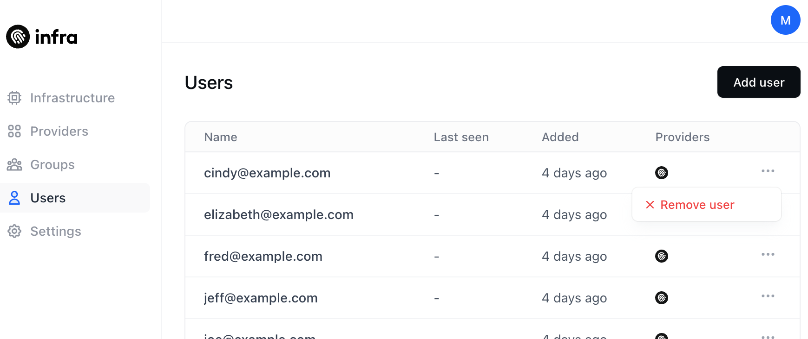

# Working with Users

## Listing users



To see all users managed by Infra, navigate to **Users**.



To see all users managed by Infra, use `infra users list`:

```bash
infra users list
```

You'll see the resulting list of users:

```bash
NAME                         LAST SEEN
fisher@infrahq.com           just now
jeff@infrahq.com             5 mintues ago
matt.williams@infrahq.com    3 days ago
michael@infrahq.com          3 days ago
```




## Adding a user



To add a user to Infra, navigate to **Users** and click the **Add User** button. Enter the users email address. They will receive an email to set their password and login to the system.




To add a user to Infra, use `infra users add`:

```bash
infra users add example@acme.com
```

You'll be provided a temporary password to share with the user (via slack, email, etc.) they should use when running `infra login`.




## Removing a user



Navigate to **Users**. To the right of each user is an ellipses button (three dots). Click it and click **Remove user**.




```bash
infra users remove example@acme.com
```




## Resetting a user's password

```bash
infra users edit example@acme.com --password
```
