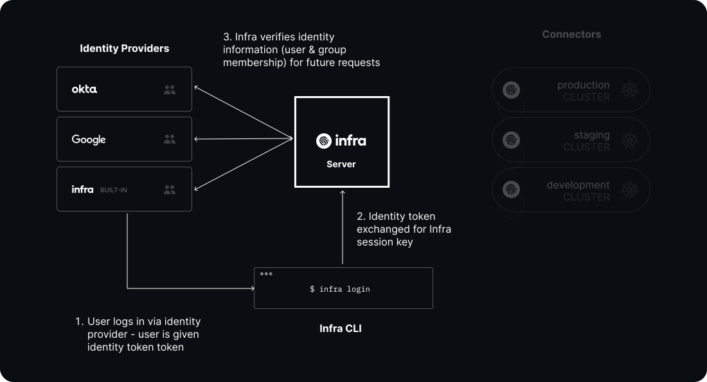
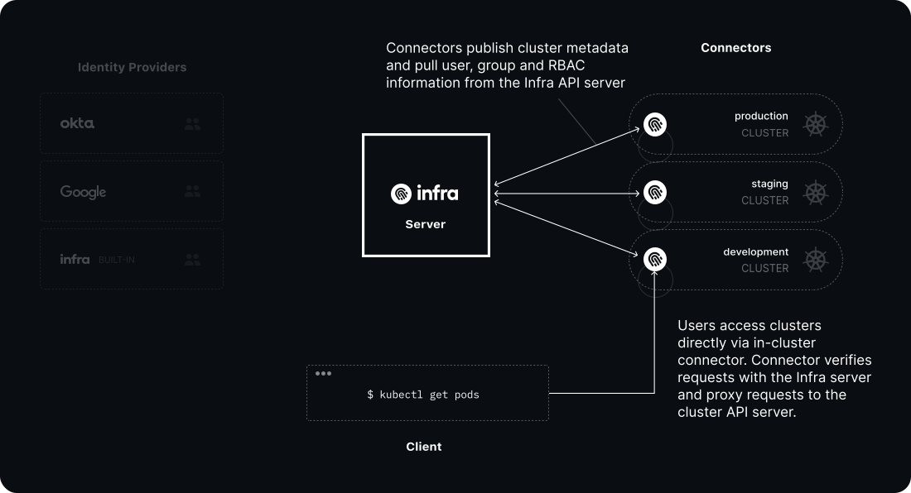
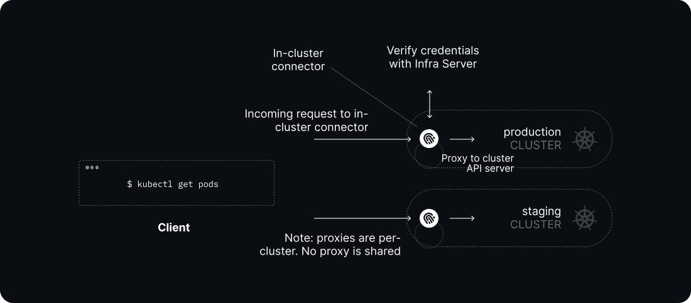

# Architecture

## Overview

## Components

### Infra Server

Infra Server is a central API server that acts as the source of truth for users, groups, identity providers and grants (learn more about these under [concepts](../getting-started/what-is-infra.md#concepts)). Its responsibilities include:

* Authenticating users via Infra's built-in identity provider, or via [identity providers](#authentication-via-identity-providers) such as Okta, Azure Active Directory or Google
* Managing access [grants](../getting-started/what-is-infra.md#grants) which map users & groups to fine-grained infrastructure roles or permissions.
* Keeping an index of all infrastructure accessible by users.
* Generating short-lived credentials for users to access infrastructure destinations.

#### Authentication via identity providers

#### Database

By default, Infra Server is configured to use SQLite for storage. It can also be configured to use [PostgreSQL](./helm-reference.md#postgres-database) instead for a high-availability configuration.

### Infra Connectors

Infra Connectors are lightweight processes that run on destination infrastructure. These connectors:

* Configure infrastructure access rules (e.g. roles) against what is stored in Infra Server
* Intercept and verify requests from users directly

Verification is done in-cluster by proxying requests sent directly from users, by verifying provided credentials with Infra Server.

### Infra CLI

[Infra CLI](./cli-reference.md) is a command-line tool for end-users to login, discover infrastructure and automatically retrieve credentials for access.
