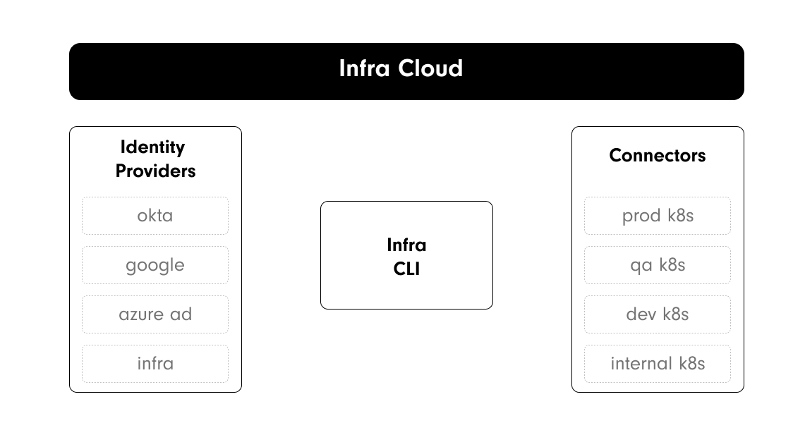
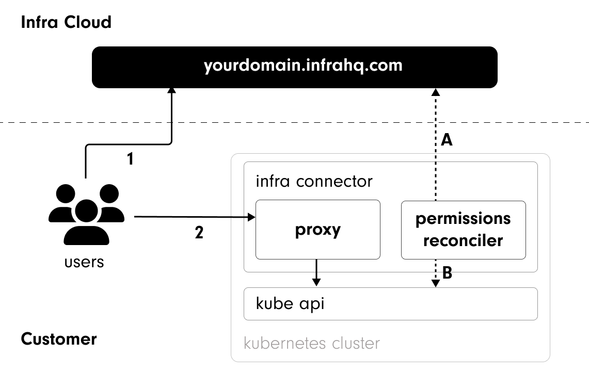

# Architecture

## Components

### Infra Cloud

Infra Cloud is a central SaaS service that acts as the source of truth for users, groups, identity providers, and permissions (grants). Its responsibilities include:

- Authenticating users via Infra's built-in identity provider, or via [identity providers](#authentication-via-identity-providers) such as Okta, Azure Active Directory or Google
- Managing access [grants](../start/what-is-infra.md#grants) which map users & groups to fine-grained infrastructure roles or permissions.
- Keeping an index of all infrastructure accessible by users.
- Generating short-lived credentials for users to access infrastructure destinations.


Learn more about users, groups, and permissions and grants under [concepts](../start/what-is-infra.md#concepts)


### Identity Providers

Identity Providers (IdP) define the users and groups for your company. If you aren't already using an IdP, you can define users and groups within Infra Cloud. Most customers will choose to integrate with their existing implementations of Okta, Google, Azure AD, and other Identity Providers.

### Connectors

Infra Connectors are lightweight processes that run on destination infrastructure. These connectors:

- Configure infrastructure access rules (e.g., roles) against what is stored in Infra Server.
- Intercept and verify requests from users directly.

Connectors have two main purposes:

- To proxy the connection from the user tools, such as `kubectl`, and the Kube API.
- To reconcile grants defined in Infra Cloud with roles defined in your Kubernetes control plane.

### Infra CLI

[Infra CLI](./cli.md) is a command-line tool for end-users to login, discover infrastructure, and automatically retrieve credentials for access. After logging in, Infra should be completely transparent to the user.

## Process Flows

There are two primary flows that run separately within Infra: User Flows and Permissions Flows.

### User Flows

1. The Infra user will run `infra login <yourdomain>.infrahq.com` to login.
2. Then all other user commands, such as `kubectl` will communicate with the proxy component of the Infra Connector to ensure the appropriate access is available for that user.

### Permission Flows

- A. Infra Connector gets User / Group permissions
- B. Infra Connector updates cluster role bindings
