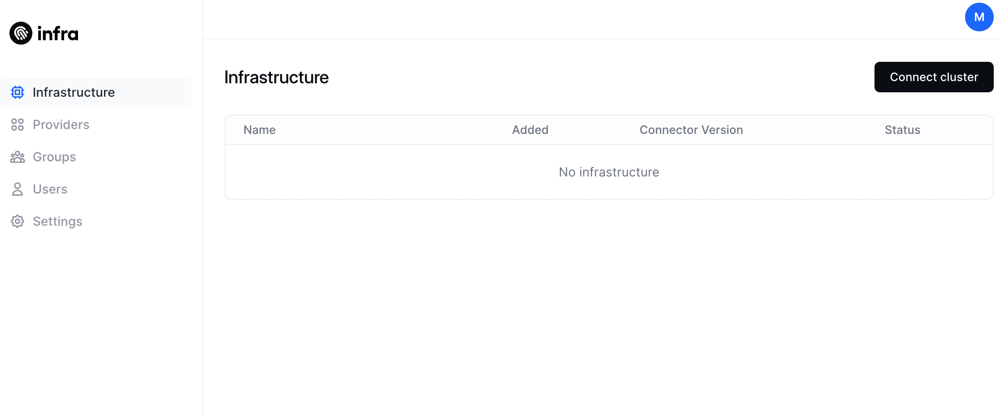

# Quickstart

## 1. Signup to Create a New Organization



Infra's cloud service is in early access. If you are interested in being part of the early access program, [let us know](/signup).



## 2. Open Your Infra Dashboard

After signing up for Infra, you should be automatically redirected to your Infra Dashboard. Be sure to also confirm your email address when you receive your introductory email.



[Learn more about the Infra Dashboard](../using/dashboard.md).

## 3. Add a Kubernetes Cluster

Make sure you have [Helm](https://helm.sh/docs/intro/install/) (v3+) already installed.

1. Navigate to **Clusters** in your Dashboard.
2. Click the **Connect cluster** button and provide a cluster name.

   You will be given the contents of a **Helm values file**. Either download the file or copy the contents to add to your own values file.

3. Then run this set of commands to install the Infra Helm repo:

   ```bash
   helm repo add infrahq https://helm.infrahq.com
   helm repo update
   ```

4. Finally, run the command shown in the UI to install the connector. If you save the values file with a name that isn't `values.yaml` you will need to change that part of the command.

[Learn more about Adding Clusters](../manage/connectors/kubernetes.md).

## 4. Add a User

1. Navigate to **Users** in the Dashboard.
2. Click the **+ User** button and enter the email of the user you wish to add.

   They will receive an email which allows them to set their password and login to Infra.

3. Navigate back to **Clusters** and choose the cluster you added above.
4. On the right side of the window, choose your user and select a role to assign to that user.

   Alternatively, you can click the plus sign next to the cluster name to see a list of namespaces and then click on one of the namespaces. Now if you choose a user and role, you will be setting access for just that namespace rather than the entire cluster.



If you want to see your cluster's roles in this list, refer to the [Using Roles](../manage/roles.md) page to see how to enable them.



[Learn more about Adding Users](../manage/users.md).

Consider adding your organization's Identity Provider, such as [Okta](../manage/idp/okta) or Azure AD or Google.

## 5. Install the CLI

The last step to actually sign in to a cluster is to install the CLI. You can find the instructions to do this for your Operating System on the [Install Infra CLI page](install-infra-cli.md).

Then run `infra login <dashboard url>`. Now you can use all your usual tools to set the context and work with Kubernetes.
